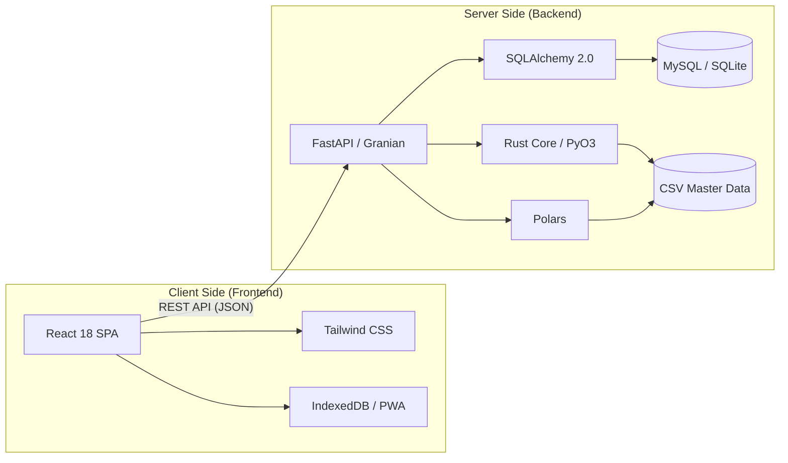

# Logix WMS 🚀

[](https://fastapi.tiangolo.com/)
[](https://reactjs.org/)
[](https://www.rust-lang.org/)
[](https://www.pola.rs/)
[](https://github.com/FIGARO79/logix_react)

**Logix WMS** es un sistema integral de gestión de almacenes (Warehouse Management System) diseñado para operaciones de alta eficiencia. Combina un núcleo de alto rendimiento escrito nativamente en **Rust (PyO3)** y un motor de datos basado en **Polars** con una interfaz moderna y reactiva, permitiendo un control total sobre el inventario, optimización de espacios y conciliación de datos críticos a velocidades insuperables.

---

## 🏛️ Arquitectura del Sistema

El proyecto sigue una arquitectura **Headless** (desacoplada), con un robusto backend desarrollado en **FastAPI** que sirve una API JSON de alto rendimiento, mientras que el frontend es una aplicación de página única (SPA) optimizada en React.



---

## ✨ Módulos Principales

### 🧠 Optimización de Slotting (Ubicación Inteligente)
- **Cálculo de Densidad**: Algoritmos avanzados para determinar la utilización volumétrica del almacén.
- **Clasificación ABC**: Ubicación automática basada en la velocidad de rotación y peso del producto.
- **Mapas de Calor**: Visualización intuitiva de la ocupación por niveles y pasillos.

### 📦 Gestión de Inventario y Conteos
- **Conteos Cíclicos**: Planificación automatizada para cumplir con auditorías periódicas.
- **Express Audit**: Módulo especializado para auditorías rápidas y prioritarias separadas del ciclo estándar.
- **Trazabilidad Total**: Registro detallado de movimientos por bin, usuario y fecha.

### 📥 Entrada y Conciliación (Inbound)
- **Conciliación Inteligente**: Motor que compara reportes ERP (Sandvik/AURR) contra existencia física en tiempo real.
- **Procesamiento de GRN**: Gestión integral de notas de recepción de mercancías con soporte para reversión y auditoría.
- **Automatización de PO**: Extracción y validación automática de Órdenes de Compra.

### 📤 Salida y Logística (Outbound)
- **Picking Verificado**: Flujos guiados por QR para garantizar precisión del 100% en envíos.
- **Consolidación de Envíos**: Agrupación eficiente de pedidos para optimizar costos de transporte.
- **Soporte Zebra ZPL**: Integración nativa con impresoras térmicas para etiquetado profesional.

---

## 🛠️ Stack Tecnológico

### Backend (`app/`)
- **Core**: FastAPI (Python 3.10+) con servidor **Granian**.
- **Heavy Processing**: Módulo nativo en **Rust** (`logix_rust_core`) compilado con Maturin/PyO3 para procesamiento intensivo y conciliaciones.
- **Data**: Polars & NumPy (procesamiento de tablas masivas).
- **ORM**: SQLAlchemy 2.0 con soporte asíncrono (**aiomysql**/**aiosqlite**).
- **Seguridad**: RBAC, HSTS, Rate Limiting (SlowAPI) y JWT/Sessions.

### Frontend (`frontend/`)
- **Core**: React 18 + Vite.
- **Styling**: Tailwind CSS (Mobile-First, Dark Mode).
- **PWA**: Soporte para funcionamiento offline y escaneo de códigos QR/Barcodes.
- **Networking**: Axios con gestión de interceptores para seguridad.

---

## 🚀 Instalación y Configuración

### Prerrequisitos
- Python 3.10 o superior.
- Node.js 18 o superior.
- MySQL/MariaDB (opcional para desarrollo, obligatorio para producción).

### 1. Configuración del Backend
```bash
# Crear entorno virtual
python -m venv venv
source venv/bin/activate  # En Linux/macOS

# Instalar dependencias
pip install -r requirements.txt

# Configurar variables de entorno
cp .env.example .env
# [IMPORTANTE] Editar .env y configurar SECRET_KEY, ADMIN_PASSWORD e INTEGRATION_API_KEY

# Ejecutar migraciones
alembic upgrade head

# Iniciar servidor (puerto 8000)
python main.py
```

### 2. Configuración del Frontend
```bash
cd frontend
npm install
npm run dev
```

---

## ⚙️ Operaciones y Mantenimiento

El sistema incluye herramientas de administración vía CLI:
- `./apply_changes.sh`: Actualización rápida de código y reconstrucción del frontend.
- `./check_resources.sh`: Diagnóstico de salud del servidor (RAM, CPU, I/O).
- `./show_db.sh`: Consultas rápidas a tablas maestras desde la terminal.

---

## 🔄 Actualizaciones Recientes (Q3 2026)
- **Núcleo Nativo en Rust**: Migración de la lógica intensiva de procesamiento de datos y mapas maestros a un módulo nativo en Rust (`logix_rust_core`) usando PyO3, incrementando masivamente el rendimiento.
- **Memoria IA en SQL**: Migración del archivo `ai_slotting_memory.json` a persistencia en base de datos SQL para mayor robustez y velocidad en la gestión de patrones de IA.
- **Seguridad de Sesiones**: Implementación de esquemas de seguridad reforzados para entornos multi-usuario.

---

**Mantenido por**: [FIGARO79](https://github.com/FIGARO79)  
**Última actualización**: Julio 2026