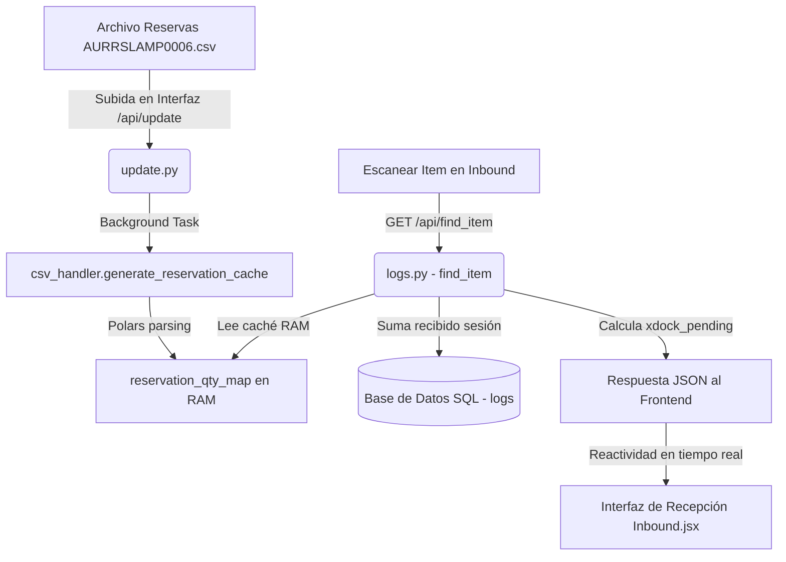

# Análisis Técnico del Servicio de Cross-Docking (Xdock) en Logix WMS

Este documento detalla el análisis exhaustivo de la arquitectura, flujo de datos, lógica de procesamiento y reglas de negocio del servicio de **Cross-Docking (Xdock)** implementado en el sistema Logix, incluyendo las recientes optimizaciones del motor de parsing y su alineación con el frontend reactivo.

---

## 1. Introducción al Concepto de Negocio
El **Cross-Docking (Xdock)** es una estrategia logística de alto impacto que consiste en transferir la mercancía entrante (Inbound) directamente a la zona de despacho (Outbound) o prepararla para pedidos específicos de clientes sin pasar por un almacenamiento intermedio en estanterías.

### Objetivos Clave en Logix:
*   **Reducción de Costos Operativos:** Elimina el doble manejo de mercancías (almacenamiento en rack y posterior picking de despacho).
*   **Velocidad de Despacho:** Acelera los tiempos de ciclo y despacho de pedidos urgentes.
*   **Optimización del Espacio:** Evita saturar ubicaciones físicas en rack con ítems que ya están vendidos u ordenados por clientes.

---

## 2. Arquitectura de Datos y Flujo de Integración
El servicio de Xdock está completamente integrado a lo largo del stack de la aplicación (Backend con FastAPI, servicios de análisis con Polars, base de datos SQL y Frontend reactivo).



### A. Ingesta y Procesamiento de Archivos (`update.py`)
El proceso se inicia cuando el administrador carga el archivo de reservas de clientes (típicamente llamado `AURRSLAMP0006.csv`).
*   **Endpoint de Carga:** `/api/update` en [update.py](file:///home/debian/logix/app/routers/update.py).
*   **Procesamiento Asíncrono:** Al recibir el archivo `reservation_file`, se almacena en el disco (`RESERVATION_CSV_PATH`) y se dispara una tarea en segundo plano (`BackgroundTasks`) ejecutando `generate_reservation_cache()` para no bloquear al usuario durante el proceso de carga.

### B. Motor de Parsing de Alto Rendimiento (`csv_handler.py`)
El parsing y consolidación del archivo se ejecuta en [csv_handler.py](file:///home/debian/logix/app/services/csv_handler.py) empleando **Polars**, garantizando lecturas ultrarápidas.

*   **Detección Prioritaria y Robusta de Columnas:** Para soportar variaciones en el archivo, el sistema inspecciona las cabeceras buscando patrones similares (case-insensitive) con prioridad:
    *   *Ítem:* Columnas que contengan `item_code` o similar.
    *   *Cantidad:* Busca prioritariamente **`action_qty`** para capturar la cantidad real solicitada por el cliente. Si no se encuentra, cae en el fallback genérico de columnas que contengan `qty` o `quantity`.
    *   *Cliente:* Columnas que contengan `customer_name` o similar, cayendo en fallbacks de `cust` o `name`.
*   **Limpieza de Datos:** Elimina caracteres de formato (como comas en números), realiza el casteo a `Float64` y mitiga nulos reemplazándolos con `0.0`.
*   **Consolidación en Caché RAM con Estructura Reactiva:**
    Agrupa por ítem y por cliente (`[item_key, cust_val]`) para acumular las cantidades de forma individual. Utiliza la capacidad nativa de `pl.struct` en Polars para formatear cada cliente exactamente con la firma que espera el frontend reactivo (`{"name": ..., "qty": ...}`):
    ```python
    pl.struct([
        pl.col("cust_val").alias("name"),
        pl.col("cust_qty").cast(pl.Int64).alias("qty")
    ]).alias("cust_info")
    ```
    Luego, los registros se consolidan en el caché RAM global (`reservation_qty_map` de tipo `Dict[str, Dict[str, Any]]`):
    ```json
    {
      "7324-4712-90": {
        "total": 374,
        "customers": [
          {
            "name": "ANTIOQUIA GOLD LTD",
            "qty": 374
          }
        ]
      }
    }
    ```
    Esto permite que cualquier consulta posterior responda en **~0 milisegundos**.

---

## 3. Lógica de Negocio y Reglas de Slotting

### A. Consulta en Tiempo Real (`logs.py`)
Cuando un operario escanea un ítem en la pantalla de Inbound, se dispara el endpoint `find_item` en [logs.py](file:///home/debian/logix/app/routers/logs.py):
1.  Se extraen los datos maestros del ítem.
2.  Se recuperan los datos de reservas desde el caché de Xdock: `total_reserved = xdock_data.get("total", 0)`.
3.  Se consulta dinámicamente en SQL el acumulado que ya ha sido recibido para ese ítem en la sesión actual: `already_received = await db_logs.get_total_received_for_item_async(db, item_code)`.
4.  Se calcula el remanente neto de reservas pendientes:
    $$\text{xdock\_pending} = \max(0, \text{total\_reserved} - \text{already\_received})$$
5.  **Exclusión de Sobreescritura en Backend:** El backend *no* altera la sugerencia de la ubicación sugerida del ítem (`suggestedBin`) con la etiqueta `"XDOCK"`. En su lugar, envía la metadata detallada al frontend (`xdockTotal`, `xdockPending`, `xdockCustomers`), delegando la visualización reactiva a la UI.

### B. Regla de Excepción Absoluta y Filtro de IA
De acuerdo con las directrices en [condiciones_slotting.md](file:///home/debian/logix/docs/condiciones_slotting.md):
1.  **Prioridad Máxima de Xdock:** Si un ítem cuenta con reservas pendientes de clientes ($\text{xdock\_pending} > 0$), el sistema **ignora por completo** todas las reglas de slotting por peso, dimensiones, rotación del ítem, y las predicciones de la Inteligencia Artificial.
2.  **Seguridad y Aislamiento de la IA:** En [ai_slotting.py](file:///home/debian/logix/app/services/ai_slotting.py) y [db_logs.py](file:///home/debian/logix/app/services/db_logs.py), se define explícitamente que la Inteligencia Artificial **nunca aprende** de ubicaciones virtuales como `"XDOCK"`, `"PUTAWAY"`, `"STAGE"`, `"TRANSITO"` o `"RECIBO"`. Esto previene que el algoritmo predictivo de almacenamiento se contamine con ubicaciones transitorias de despacho rápido.

---

## 4. Visualización Reactiva en el Frontend
El frontend en [Inbound.jsx](file:///home/debian/logix/frontend/src/pages/Inbound.jsx) consume esta información de forma reactiva y en tiempo real para instruir al operario.

*   **Cálculo Dinámico Local:**
    ```javascript
    const effectiveXdockPending = Math.max(0, (itemData?.xdockTotal || 0) - cumulativeQty);
    ```
    Esto permite descontar en vivo las unidades recibidas y actualizar la cantidad pendiente conforme el operario va guardando registros.
*   **Alertas Visuales UI (Premium UX):**
    *   **Banner de Alerta Roja:** Si `effectiveXdockPending > 0`, se muestra una sección destacada en color rojo (`bg-red-50 border-2 border-red-200`) alertando la necesidad inmediata de **XDOCK**.
    *   **Desglose detallado por Clientes:** La UI mapea la lista `xdockCustomers` y renderiza el nombre (`c?.name`) y las cantidades (`c?.qty`) de forma exacta e individualizada, facilitando la segregación física del material (por ejemplo, etiquetando cajas para clientes específicos).
    *   **Sugerencia de Ubicación Especial:** Si el artículo no cuenta con ubicación en el almacén (es `N/A`), se activa un botón de color ámbar con el texto `"UBICACIÓN + XDOCK"`, permitiendo asignar la sugerencia de almacenamiento directamente a la zona de Cross-Docking con un solo tap.

---

## 5. Buenas Prácticas y Mantenimiento
1.  **Garantía de Tipo (Type Safety):** Se asegura el casteo estricto a tipos enteros (`pl.Int64` e `int`) en backend para las cantidades procesadas, previniendo errores de interpolación al JSON de respuesta.
2.  **Soporte Multi-Esquema:** El fallback dinámico en la selección de columnas protege el motor en caso de que el archivo CSV de reservas sea exportado bajo diferentes configuraciones regionales o de cabeceras desde SAP/ERP.
3.  **Monitoreo Offline:** Las consultas enIndexedDB deben sincronizarse utilizando los mismos desgloses estructurados para mantener la congruencia entre el flujo offline y la posterior sincronización remota.
