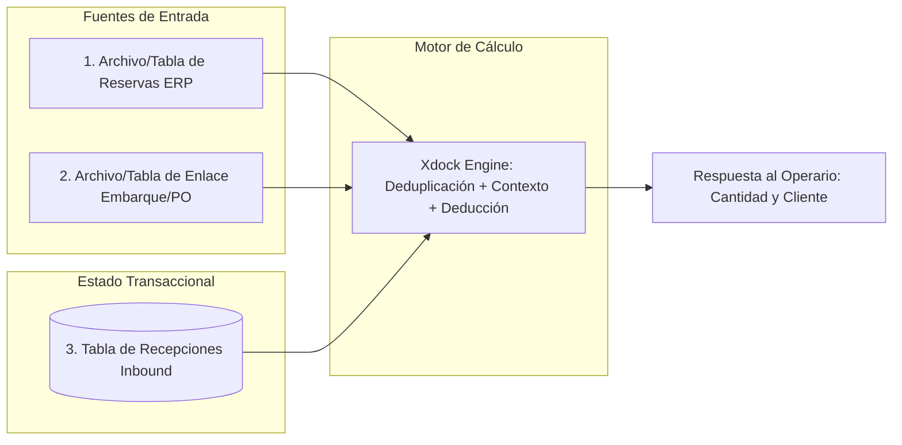

# Guía de Especificación y Fórmulas: Implementación de Lógica Xdock en Otras Aplicaciones

Este documento define la **especificación técnica, fórmulas matemáticas, contratos de datos y pseudocódigo** necesarios para trasladar e implementar el motor de **Cross-Docking (Xdock)** de Logix en cualquier otra plataforma o lenguaje de desarrollo (Python, Node.js, Go, Rust, Java, C#, etc.).

---

## 1. Arquitectura de Datos y Entidades Requeridas

> [!TIP]
> **Formatos descargables listos para compartir:**
> * 📄 [Descargar versión en PDF](file:///home/debian/logix/docs/guia_implementacion_xdock.pdf)
> * 📝 [Descargar versión en Word (.docx)](file:///home/debian/logix/docs/guia_implementacion_xdock.docx)

Para implementar Xdock en otra aplicación se requieren 3 fuentes de datos estructuradas o tablas:

<p align="center">
  
</p>

<details>
<summary><b>Ver código fuente Mermaid del diagrama</b></summary>



</details>


### A. Entidad de Entrada: Reservas de Venta (`Reservations`)
Representa los pedidos en firme de clientes sobre mercancía en tránsito o por ingresar.

* **Archivo de Origen en `/update`:** `AURRSLAMP0006.csv`
* **Campo Formulario en `/api/update`:** `reservation_file` (`UploadFile`)
* **Patrón de detección en Frontend:** Archivos cuyo nombre contenga `'0006'` o `'reserva'` (ej. `AURRSLAMP0006.csv`).

| Campo en Archivo | Tipo Requerido | Propósito en el Motor de Xdock |
| :--- | :--- | :--- |
| `Item_Code` | `String` | Identificador único del SKU (normalizado a mayúsculas y sin espacios). |
| `Action_QTY` | `Float` o `Decimal` | Cantidad solicitada/reservada por el cliente (prioridad de asignación). |
| `Customer_Name` | `String` | Nombre o razón social del cliente final. |
| `Customer_Code` | `String` | Código identificador del cliente en el ERP (ej. `00090`). |
| `PO_Number` | `String` | Orden de compra que respalda la adquisición del material. |
| `SO_Number` | `String` (opcional) | Número de la orden de venta (Sales Order). |
| `SO_Line_Number` | `String` (opcional) | Número de ítem/línea dentro de la orden de venta (usado para desduplicar). |

---

### B. Entidad de Enlace: Embarque a Órdenes de Compra (`Shipment_PO_Mapping`)
Asocia qué Órdenes de Compra (POs) viajan físicamente en el embarque actual (`import_reference` / `shipment_id`). Se nutre de dos archivos combinados en el proceso de actualización:

#### 1. Archivo Extractor de Órdenes de Compra:
* **Archivo de Origen en `/update`:** `Purchase Order Extractor.xlsx`
* **Campo Formulario en `/api/update`:** `po_extractor` (`UploadFile`)
* **Patrón de detección en Frontend:** Archivos cuyo nombre contenga `'extractor'` o `'purchase'`.
* **Salida de Procesamiento:** Genera la estructura relacional en memoria / JSON (`po_lookup.json`).

#### 2. Reporte de Recepciones Esperadas GRN:
* **Archivo de Origen en `/update`:** `AURRSGLBD0280.csv` (o `.xlsx`)
* **Campo Formulario en `/api/update`:** `grn_file` (si es CSV) o `grn_excel` (si es Excel).
* **Patrón de detección en Frontend:** Archivos cuyo nombre contenga `'280'`, `'grn'`, `'pedido'`, `'reporte'` o `'inbound'`.

| Campo en Estructura Relacional | Origen | Propósito en el Motor de Xdock |
| :--- | :--- | :--- |
| `import_reference` / `shipment_id` | `po_lookup.json` / GRN | Identificador del embarque o contenedor activo (ej. `CO-2026-001`). |
| `item_code` | `po_lookup.json` / GRN | SKU presente en dicho embarque. |
| `po_number` / `customer_ref` | `po_lookup.json` / `Order_Number` | Número de PO contenido en ese embarque para filtrar el Xdock. |
| `grn_number` | `AURRSGLBD0280.csv` | Número de remisión/GRN asociada al pedido. |

---

### C. Entidad de Soporte: Maestro de Artículos (`Master_Items`)
Proporciona la descripción, peso, dimensiones y ubicación física habitual del inventario.

* **Archivo de Origen en `/update`:** `AURRSGLBD0250.csv`
* **Campo Formulario en `/api/update`:** `item_master` (`UploadFile`)
* **Patrón de detección en Frontend:** Archivos cuyo nombre contenga `'master'`, `'item'`, `'maestro'` o `'250'`.

---

### D. Entidad Transaccional: Registro de Recepciones (`Receiving_Logs`)
Historial de unidades efectivamente ingresadas y validadas en el almacén en tiempo real.

* **Origen de Datos:** Se genera dinámicamente desde la interfaz de Inbound ([`Inbound.jsx`](file:///home/debian/logix/frontend/src/pages/Inbound.jsx)) mediante `POST /api/save_log` o `POST /api/save_multiple_logs`.
* **Persistencia:** Tabla SQL `logs` en MySQL/SQLite ([`sql_models.py`](file:///home/debian/logix/app/models/sql_models.py#L58-L81)).

| Campo en Tabla `logs` | Tipo | Propósito en el Cálculo de Xdock |
| :--- | :--- | :--- |
| `importReference` | `VARCHAR(100)` | Filtra los registros que pertenecen al embarque actual. |
| `itemCode` | `VARCHAR(100)` | Código del SKU recibido para acumular lo entregado. |
| `qtyReceived` | `INTEGER` | Cantidad física ingresada (se acumula con `SUM(qtyReceived)`). |
| `relocatedBin` | `VARCHAR(100)` | Ubicación asignada por el operario (`"XDOCK"` para despacho directo). |
| `archived_at` | `VARCHAR(50)` | Excluye recepciones archivadas (`WHERE archived_at IS NULL`). |

---

## 2. Fórmulas Matemáticas y Reglas de Negocio

### Fórmula 1: Deduplicación Robusta de Líneas de Pedido (ERP)

* **Capa Arquitectónica:** Ingesta y ETL / Preprocesamiento de Archivos.
* **Lenguaje en Logix:** **Rust** ([`rust_core/src/reservations.rs`](file:///home/debian/logix/rust_core/src/reservations.rs)) y alternativa en **Python** ([`csv_handler.py`](file:///home/debian/logix/app/services/csv_handler.py)).
* **Equivalente en Base de Datos:** **SQL** (PostgreSQL / MySQL / SQLite).

Los extractos automáticos de ERP a menudo repiten filas de la misma línea de orden de venta con actualizaciones progresivas. Para una misma tupla identificadora:

$$K = (\text{item\_code}, \text{po\_number}, \text{so\_number}, \text{so\_line}, \text{customer\_id})$$

La cantidad consolidada de esa línea se calcula tomando el valor máximo reportado:

$$Q_{\text{line}}(K) = \max_{r \in R_K} (r.\text{action\_qty})$$

Si el ERP no entrega números de orden de venta (`so_number` o `so_line`), se agrupa sumando de forma unificada:

$$Q_{\text{group}}(\text{item}, \text{po}, \text{customer}) = \sum r.\text{action\_qty}$$

<details>
<summary><b>Ver implementación en SQL / Rust / Python</b></summary>

```sql
-- Implementación en SQL
SELECT item_code, po_number, customer_name, MAX(action_qty) AS qty
FROM erp_reservations
WHERE action_qty > 0
GROUP BY item_code, po_number, so_number, so_line_number, customer_name;
```

```rust
// Implementación en Rust (PyO3 / Native)
let entry = so_line_map.entry((item_code, po_number, so_num, so_line, cust_val)).or_insert(0.0);
if qty > *entry { *entry = qty; }
```

```python
# Implementación en Python
key = (item_code, po_number, so_number, so_line, customer_name)
so_line_map[key] = max(so_line_map.get(key, 0.0), action_qty)
```
</details>

---

### Fórmula 2: Filtrado Contextual por Embarque (PO Matching)

* **Capa Arquitectónica:** Orquestador de Datos / Lógica de Servicio.
* **Lenguaje en Logix:** **Python (FastAPI)** en Backend ([`csv_handler.py`](file:///home/debian/logix/app/services/csv_handler.py#L311-L359)) y **JavaScript** en Frontend Offline ([`Inbound.jsx`](file:///home/debian/logix/frontend/src/pages/Inbound.jsx#L835-L878)).
* **Equivalente en Base de Datos:** **SQL** (`INNER JOIN` o subconsulta `IN`).

Un SKU puede tener reservas para el cliente **A** en la orden **PO-100** (que llega hoy en el contenedor actual) y reservas para el cliente **B** en la orden **PO-200** (que llegará en dos meses).

Sea $P_{\text{shipment}}(I, S)$ el conjunto de órdenes de compra válidas para el ítem $I$ en el embarque $S$:

$$P_{\text{shipment}}(I, S) = \{ p \in \text{PO\_List} \mid \text{asociadas a } (I, S) \}$$

El universo de reservas a considerar en la recepción se filtra estrictamente:

$$R_{\text{filtered}}(I, S) = \begin{cases} 
\{ r \in R(I) \mid r.\text{po\_number} \in P_{\text{shipment}}(I, S) \} & \text{si } P_{\text{shipment}}(I, S) \neq \emptyset \\
R(I) & \text{si no se especifica embarque}
\end{cases}$$

El total reservado aplicable para el embarque es:

$$T_{\text{reserved}} = \sum_{r \in R_{\text{filtered}}} r.\text{qty}$$

<details>
<summary><b>Ver implementación en Python / JavaScript / SQL</b></summary>

```python
# Implementación en Python
target_pos = set(await get_pos_for_shipment(shipment_id, item_code))
filtered_customers = [c for c in raw_customers if c.get("po_number") in target_pos]
total_reserved = sum(float(c.get("qty", 0.0)) for c in filtered_customers)
```

```javascript
// Implementación en JavaScript / TypeScript
const targetPosSet = new Set(targetPosList);
const filteredCustomers = rawCustomers.filter(c => targetPosSet.has(c.po_number));
const totalReserved = filteredCustomers.reduce((acc, c) => acc + (c.qty || 0), 0);
```

```sql
-- Implementación en SQL
SELECT SUM(r.qty) AS total_reserved
FROM reservations r
WHERE r.item_code = :item_code
  AND r.po_number IN (
      SELECT sp.po_number 
      FROM shipment_pos sp 
      WHERE sp.shipment_id = :shipment_id AND sp.item_code = :item_code
  );
```
</details>

---

### Fórmula 3: Saldo Neto Pendiente de Cross-Docking

* **Capa Arquitectónica:** Endpoint de Consulta en Tiempo Real / API REST.
* **Lenguaje en Logix:** **Python (FastAPI)** ([`logs.py`](file:///home/debian/logix/app/routers/logs.py#L200)), **SQL** ([`db_logs.py`](file:///home/debian/logix/app/services/db_logs.py#L307)) y **JavaScript** ([`Inbound.jsx`](file:///home/debian/logix/frontend/src/pages/Inbound.jsx#L881)).

Dado el total acumulado de unidades que ya han sido recibidas en la sesión activa para el ítem $I$ en el embarque $S$:

$$A_{\text{received}} = \sum \text{qty\_received}_{\text{activas}}(I, S)$$

El saldo neto de Cross-Docking pendiente ($X_{\text{pending}}$) se rige por:

$$X_{\text{pending}} = \max(0, T_{\text{reserved}} - A_{\text{received}})$$

* **Si $X_{\text{pending}} > 0$:** La mercancía **DEBE** enviarse a `"XDOCK"`.
* **Si $X_{\text{pending}} = 0$:** La cuota de pedidos de clientes ya fue satisfecha; el excedente pasa a slotting tradicional de almacenamiento en estantería (rack).

<details>
<summary><b>Ver implementación en Python / SQL / JavaScript</b></summary>

```python
# Implementación en Python (FastAPI)
already_received = await db.scalar(
    select(func.coalesce(func.sum(Log.qtyReceived), 0))
    .where(Log.importReference == import_ref, Log.itemCode == item_code, Log.archived_at.is_(None))
)
xdock_pending = max(0, total_reserved - already_received)
```

```javascript
// Implementación en JavaScript
const xdockPending = Math.max(0, totalReserved - alreadyReceived);
```
</details>

---

### Fórmula 4: Deducción Secuencial por Cliente (Algoritmo FIFO de Asignación)

* **Capa Arquitectónica:** Serialización de Respuesta / Enriquecimiento de Datos para UI.
* **Lenguaje en Logix:** **Python** ([`logs.py`](file:///home/debian/logix/app/routers/logs.py#L202-L220)) y **JavaScript** ([`Inbound.jsx`](file:///home/debian/logix/frontend/src/pages/Inbound.jsx#L855-L875)).

Para mostrarle al operario qué cliente específico está recibiendo la mercancía en cada caja o pallet, lo ya recibido se descuenta de forma secuencial:

Sea una lista ordenada de clientes $C = [c_1, c_2, \dots, c_n]$ con cantidades $[q_1, q_2, \dots, q_n]$.  
Sea el remanente a deducir inicial $D_0 = A_{\text{received}}$.

Para cada cliente $i = 1, \dots, n$:

$$q'_i = \max(0, q_i - D_{i-1})$$

$$D_i = \max(0, D_{i-1} - q_i)$$

* Si $q'_i > 0$, el cliente $c_i$ aún tiene $q'_i$ unidades pendientes y se envía en la respuesta para el operario.
* Si $q'_i = 0$, el pedido del cliente $c_i$ ya está completo y no se muestra como pendiente.

<details>
<summary><b>Ver implementación en Python / JavaScript</b></summary>

```python
# Implementación en Python
xdock_customers = []
rem_deduct = float(already_received)

for c in filtered_customers:
    c_qty = float(c.get("qty", 0.0))
    if rem_deduct >= c_qty:
        rem_deduct -= c_qty
    else:
        pending_qty = c_qty - rem_deduct
        rem_deduct = 0.0
        xdock_customers.append({**c, "qty": pending_qty, "original_qty": c_qty})
```

```javascript
// Implementación en JavaScript (React / Node.js)
let remDeduct = Number(alreadyReceived || 0);
const pendingCustomers = [];

for (const c of filteredCustomers) {
    const cQty = Number(c.qty || 0);
    if (remDeduct >= cQty) {
        remDeduct -= cQty;
    } else {
        pendingCustomers.push({ ...c, qty: cQty - remDeduct, originalQty: cQty });
        remDeduct = 0;
    }
}
```
</details>

---

### Fórmula 5: Reactividad Local en Cliente (Frontend sin Latencia)

* **Capa Arquitectónica:** Vista de Usuario (UI) / Estado Reactivo del Cliente.
* **Lenguaje en Logix:** **JavaScript / React (JSX)** ([`frontend/src/pages/Inbound.jsx`](file:///home/debian/logix/frontend/src/pages/Inbound.jsx#L1128-L1130)).

En la interfaz de usuario, conforme el operador agrega renglones a una tabla temporal de recepción local antes de consolidar el lote con el servidor:

$$X_{\text{effective\_pending}} = \max\left(0, T_{\text{reserved}} - \sum_{\text{renglones locales}} \text{qty}\right)$$

<details>
<summary><b>Ver implementación en React (JavaScript / TypeScript)</b></summary>

```javascript
// Implementación en React (JavaScript / TypeScript)
const cumulativeQty = tableLogs
    .filter(log => log.itemCode === currentItemCode)
    .reduce((sum, log) => sum + Number(log.qtyReceived || 0), 0);

const effectiveXdockPending = Math.max(0, (itemData?.xdockTotal || 0) - cumulativeQty);
```
</details>

---

## 3. Pseudocódigo Completo de Implementación

### Módulo 1: Procesamiento y Caché del Archivo de Reservas (Backend)

```python
def build_reservation_cache(csv_records):
    # 1. Deduplicación por línea SO
    so_line_map = {}   # (item, po, so, line, customer) -> max_qty
    fallback_map = {}  # (item, po, customer) -> sum_qty

    for row in csv_records:
        item = row.item_code.strip().upper()
        po = row.po_number.strip().upper()
        cust = f"{row.customer_code} - {row.customer_name}".strip()
        qty = float(row.action_qty)
        
        if qty <= 0:
            continue

        if row.so_number and row.so_line_number:
            key = (item, po, row.so_number.strip(), row.so_line_number.strip(), cust)
            so_line_map[key] = max(so_line_map.get(key, 0.0), qty)
        else:
            key = (item, po, cust)
            fallback_map[key] = fallback_map.get(key, 0.0) + qty

    # 2. Consolidación por Ítem
    item_cache = {}  # item_code -> { total, customers: [] }

    # Unir ambas fuentes
    aggregated = {}  # item_code -> { (cust, po) -> qty }
    
    for (item, po, so, line, cust), qty in so_line_map.items():
        aggregated.setdefault(item, {})
        aggregated[item][(cust, po)] = aggregated[item].get((cust, po), 0.0) + qty

    for (item, po, cust), qty in fallback_map.items():
        aggregated.setdefault(item, {})
        aggregated[item][(cust, po)] = aggregated[item].get((cust, po), 0.0) + qty

    # 3. Formatear estructura lista para consulta en RAM
    for item, cust_dict in aggregated.items():
        total_item = sum(cust_dict.values())
        customers_list = []
        
        for (cust, po), qty in sorted(cust_dict.items(), key=lambda x: (x[0][1], x[0][0])):
            label = f"{cust} (PO: {po})" if po else cust
            customers_list.append({
                "customer_name": cust,
                "po_number": po,
                "label": label,
                "qty": qty
            })

        item_cache[item] = {
            "total": total_item,
            "customers": customers_list
        }

    return item_cache
```

---

### Módulo 2: Endpoint de Consulta en Tiempo Real (`find_item`)

```python
async def find_item_xdock(item_code, shipment_id, db, cache):
    item = item_code.strip().upper()
    raw_data = cache.get(item, {"total": 0, "customers": []})
    
    # 1. Filtrado por Embarque (Shipment/PO)
    if shipment_id:
        target_pos = await db.get_pos_for_shipment_and_item(shipment_id, item)
        filtered_customers = [c for c in raw_data["customers"] if c["po_number"] in target_pos]
        total_reserved = sum(c["qty"] for c in filtered_customers)
    else:
        filtered_customers = raw_data["customers"]
        total_reserved = raw_data["total"]

    # 2. Consultar acumulado ya recibido en DB
    already_received = await db.execute(
        "SELECT COALESCE(SUM(qty_received), 0) FROM receiving_logs "
        "WHERE shipment_id = :s AND item_code = :i AND is_active = TRUE",
        {"s": shipment_id, "i": item}
    )

    # 3. Calcular saldo neto
    xdock_pending = max(0, total_reserved - already_received)

    # 4. Deducción secuencial de clientes
    xdock_customers = []
    rem_deduct = float(already_received)

    for c in filtered_customers:
        c_qty = float(c["qty"])
        if rem_deduct >= c_qty:
            rem_deduct -= c_qty
        else:
            pending_qty = c_qty - rem_deduct
            rem_deduct = 0.0
            xdock_customers.append({
                "customer_name": c["customer_name"],
                "po_number": c["po_number"],
                "label": c["label"],
                "qty": pending_qty,
                "original_qty": c_qty
            })

    return {
        "xdock_total": total_reserved,
        "xdock_pending": xdock_pending,
        "xdock_customers": xdock_customers,
        "is_xdock_required": xdock_pending > 0
    }
```

---

## 4. Reglas Críticas de Exclusión (Aislamiento de Slotting e IA)

Al incorporar Xdock en una solución WMS que incluya algoritmos de Slotting o Inteligencia Artificial para sugerir pasillos y cajones de almacén:

```python
def on_item_relocated_or_received(item_code, chosen_bin):
    VIRTUAL_BINS = {"XDOCK", "PUTAWAY", "STAGE", "TRANSITO", "RECIBO"}
    
    # REGLA 1: La IA nunca aprende de bines virtuales
    if chosen_bin.upper().strip() in VIRTUAL_BINS:
        return  # Omitir entrenamiento de patrones espaciales

    # REGLA 2: No guardar en el histórico de ubicación física permanente
    update_permanent_bin_memory(item_code, chosen_bin)
```

---

## 5. Ejemplo Práctico Numérico de Validación

Supongamos el siguiente caso de prueba para validar que su implementación funcione correctamente:

### Entrada:
* **SKU:** `BEARING-01`
* **Embarque Actual:** `SHIP-2026-A`
* **Reservas registradas en CSV:**
  * Cliente 1 (`MINA OCCIDENTE`): 5 UN en `PO-101`
  * Cliente 2 (`CANTERA NORTE`): 10 UN en `PO-101`
  * Cliente 3 (`CONSTRUCTORA SUR`): 20 UN en `PO-999` (No viene en este embarque)
* **Órdenes en `SHIP-2026-A` para `BEARING-01`:** `[PO-101]`

### Ejecución Paso a Paso:

1. **Filtrado Contextual:**
   * Se descarta el Cliente 3 porque `PO-999` no está en el embarque `SHIP-2026-A`.
   * Clientes elegibles: Cliente 1 (5 UN) y Cliente 2 (10 UN).
   * **`xdock_total` = 15 UN**.

2. **Recepción 1 (Operador recibe 3 UN):**
   * `already_received` = 0 UN $\rightarrow$ `xdock_pending` = $\max(0, 15 - 0) = \mathbf{15\text{ UN}}$.
   * El operario ingresa 3 UN en la estación de trabajo y las confirma hacia `"XDOCK"`.
   * En la base de datos se guarda `qty_received = 3`.

3. **Recepción 2 (Operador consulta el SKU nuevamente):**
   * `already_received` = 3 UN.
   * `xdock_pending` = $\max(0, 15 - 3) = \mathbf{12\text{ UN}}$.
   * **Deducción de Clientes:**
     * Deducción inicial = 3 UN.
     * Cliente 1: $5 - 3 = \mathbf{2\text{ UN}}$ pendientes. (Deducción remanente = 0 UN).
     * Cliente 2: $10 - 0 = \mathbf{10\text{ UN}}$ pendientes.
     * Lista enviada a la UI: Cliente 1 (2 UN), Cliente 2 (10 UN).

4. **Recepción 3 (Operador recibe 15 UN más):**
   * Total acumulado en base de datos: $3 + 15 = 18\text{ UN}$.
   * `xdock_pending` = $\max(0, 15 - 18) = \mathbf{0\text{ UN}}$.
   * Como `xdock_pending == 0`:
     * El banner rojo de XDOCK se apaga.
     * Se habilita la sugerencia habitual de slotting en estantería para las 3 unidades sobrantes (excedente).
     * La lista `xdock_customers` se retorna vacía `[]`.
