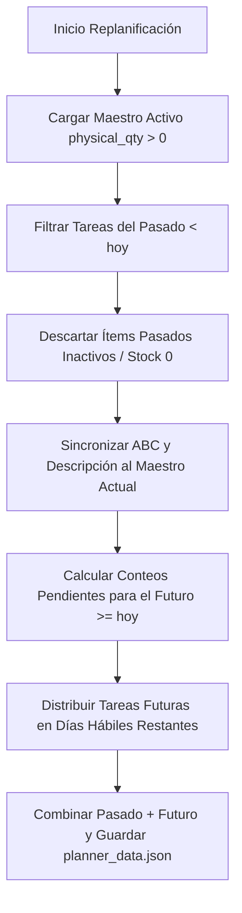

# Documentación: Lógica de Planificación y Conteo Cíclico de Inventario

Este documento describe la arquitectura, reglas de negocio y algoritmos utilizados por el sistema **Logix** para la planificación, replanificación y ejecución de conteos cíclicos de inventario.

---

## 1. Fuentes de Datos y Criterio de Selección

El sistema de planificación de conteos interactúa con el Maestro de Ítems sincronizado desde los sistemas ERP.

- **Fuente de verdad:** El reporte de inventario físico `AURRSGLBD0250.csv` (conocido internamente como **"El 250"**).
- **Entidad en Base de Datos:** `MasterItem` (SQL).
- **Criterio de Inclusión:** El motor de planificación filtra estrictamente los ítems que poseen existencia física positiva:
  $$\text{MasterItem.physical\_qty} > 0$$
  *Ítems con stock cero o sin presencia en el reporte activo son excluidos automáticamente de la planificación de conteos.*

---

## 2. Frecuencia y Reglas de Negocio (Clasificación ABC)

Los ítems se agrupan según su clasificación ABC definida en el almacén. La frecuencia de conteo cíclico anual es la siguiente:

| Clasificación ABC | Frecuencia de Conteo Anual | Descripción |
| :---: | :---: | :--- |
| **A** | **3 conteos / año** | Ítems de alta rotación o alto valor |
| **B** | **2 conteos / año** | Ítems de rotación o valor medio |
| **C** | **1 conteo / año** | Ítems de baja rotación o bajo valor |

---

## 3. Algoritmo de Generación de la Planificación (`calculate_count_plan_data`)

La planificación utiliza el rango de fechas (`start_date` y `end_date`) configurado en los **Parámetros Generales** de la interfaz (por defecto, del 1 de enero al 31 de diciembre del año en curso) y distribuye los conteos requeridos de manera uniforme a lo largo del período.

### 3.1 Días Hábiles
El sistema calcula los días laborales en el rango de **Parámetros Generales** excluyendo:
1. Sábados y Domingos.
2. Días festivos registrados en la configuración (`planner_config.json`).

### 3.2 Cálculo de Tareas Pendientes
Para cada ítem activo, el sistema determina cuántos conteos restan por realizar en el año:

$$\text{Pendientes} = \max\left(0,\, \text{Requerido}_{\text{ABC}} - (\text{Conteos Ejecutados} + \text{Conteos Planificados Pasados})\right)$$

- **Conteos Ejecutados:** Registros en la tabla `CycleCount` acumulados en el año actual.
- **Conteos Planificados Pasados:** Tareas que ya fueron agendadas en fechas anteriores del plan actual.

### 3.3 Balanceo de Carga Diaria
Las tareas pendientes son mezcladas de forma aleatoria (`random.shuffle`) y distribuidas equitativamente entre los días hábiles del período mediante un algoritmo Round-Robin:

$$\text{Día Asignado} = \text{Días Hábiles}\Big[i \pmod{\text{Total Días Hábiles}}\Big]$$

---

## 4. Lógica de Replanificación Incremental (`update_plan`)

Cuando se ejecuta una **Replanificación**, el sistema no destruye el historial pasado, sino que aplica una actualización incremental inteligente:

### Principios de la Replanificación:
1. **Meses y Días Pasados (< hoy): NO se recalculan.** Conservan sus fechas de planificación originales de forma congelada. Solo se filtran para eliminar ítems que hoy en día ya no poseen existencia física.
2. **Meses y Días Futuros (≥ mañana): SÍ se recalculan.** El sistema toma los días hábiles disponibles desde mañana hasta la fecha fin configurada y redistribuye de forma equitativa únicamente las tareas pendientes.
3. **Sincronización de Atributos:** Si un ítem cambió de clasificación ABC o descripción en la última actualización del 250, sus registros pasados se actualizan con la nueva clasificación.
4. **Control de Inflación:** Los conteos agendados en los meses pasados se restan del requerimiento total anual para garantizar que el futuro programe únicamente lo necesario.

---

## 5. Módulo de Ejecución Diaria

1. **Obtención de Tareas Diarias (`/execution/daily_items`):** Retorna los ítems agendados para la fecha seleccionada con sus ubicaciones físicas (`bin_1` y ubicaciones adicionales).
2. **Registro y Conteo:** Los operarios ingresan las cantidades contadas. El sistema registra las diferencias ($\text{Físico} - \text{Sistema}$).
3. **Reconteos Automáticos (`/execution/items_with_differences`):** Si se detectan discrepancias en el primer conteo, el sistema genera automáticamente una vista de reconteo para verificar la ubicación antes de ajustar la base de datos.
