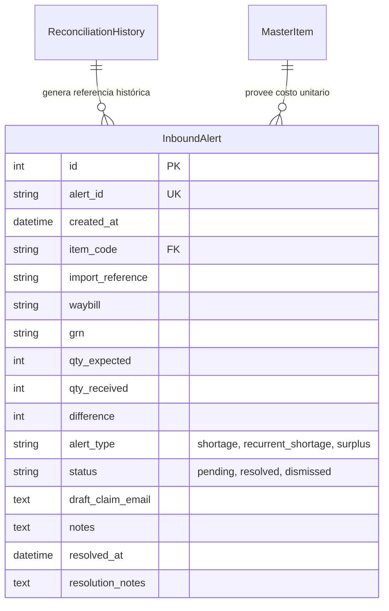

# Propuesta de Optimización y Alto Desempeño: Agente de Auditoría de Inbound

Este documento detalla los problemas de rendimiento actuales del **Agente de Auditoría de Inbound** en LOGIX WMS y propone un plan integral para mejorar tanto su velocidad (desempeño computacional) como su inteligencia operativa (desempeño de negocio).

---

## 1. Arquitectura y Cuellos de Botella Actuales

El agente local de auditoría de recepción (`run_inbound_audit` en [inbound_auditor.py](file:///home/fabio/Programacion/logix_react/app/services/inbound_auditor.py)) opera cruzando los datos calculados de conciliación activa con el historial de base de datos para alertar al usuario sobre discrepancias físicas (sobrantes/faltantes).

Sin embargo, el diseño actual tiene tres limitaciones críticas de rendimiento y escalabilidad:

### A. Consultas SQL N+1 en Bucle
Para cada ítem detectado con faltante (`difference < 0`), el agente realiza una consulta individual a la base de datos histórica ([sql_models.py](file:///home/fabio/Programacion/logix_react/app/models/sql_models.py#L268-L284)) para contar las incidencias recurrentes de ese ítem:

```python
# Dentro del loop de calculations
stmt = select(func.count(func.distinct(ReconciliationHistory.import_reference))).where(
    ReconciliationHistory.item_code == item_code,
    ReconciliationHistory.import_reference != import_ref,
    ReconciliationHistory.difference < 0
)
res = await db.execute(stmt)
recurrent_count = res.scalar() or 0
```

> [!WARNING]
> Si una importación tiene 100 ítems con diferencias, el servidor realiza **100 conexiones consecutivas e individuales de ida y vuelta a la base de datos**, lo cual degrada exponencialmente el rendimiento del hilo del servidor API de FastAPI.

### B. Persistencia Basada en Archivo JSON Único
Actualmente, las alertas activas e históricas se almacenan en un archivo JSON plano centralizado (`inbound_audit_alerts.json`).
* **Inseguridad de concurrencia**: Si múltiples peticiones o tareas en segundo plano ejecutan la auditoría simultáneamente, existe riesgo de corrupción del archivo o de que se sobrescriban las alertas resueltas por el usuario.
* **Sobrecarga de I/O**: Cada vez que se lee (`load_alerts()`) o se guarda (`save_alerts()`), se lee/escribe todo el JSON en el disco, lo cual genera alta latencia si el historial crece.

### C. Carga Masiva de Alertas al Frontend
El endpoint `/api/inbound/auditor/alerts` descarga la lista completa del JSON sin ningún filtro o paginación. Conforme se acumulan alertas archivadas, la página del navegador ([InboundAudit.jsx](file:///home/fabio/Programacion/logix_react/frontend/src/pages/InboundAudit.jsx)) cargará más lento debido al tamaño de la carga de red (payload).

---

## 2. Plan de Optimización de Desempeño (Performance)

### Solución 1: Eliminar consultas N+1 usando Bulk Queries (SQL)
En lugar de consultar la base de datos en cada iteración del bucle, podemos recolectar todos los códigos de ítems con discrepancia y realizar **una única consulta SQL** para obtener la recurrencia histórica de todos a la vez.

```python
# 1. Identificar códigos de ítems con faltantes
shortage_item_codes = {row.get("Codigo_Item") for row in calculations if row.get("Diferencia", 0) < 0}

# 2. Consultar recurrencias históricas en un solo paso
recurrence_map = {}
if shortage_item_codes:
    stmt = select(
        ReconciliationHistory.item_code, 
        ReconciliationHistory.import_reference
    ).where(
        ReconciliationHistory.item_code.in_(list(shortage_item_codes)),
        ReconciliationHistory.difference < 0
    )
    res = await db.execute(stmt)
    rows = res.all() # Retorna tuplas (item_code, import_reference)
    
    # Agrupar en Python
    for item, imp_ref in rows:
        if item not in recurrence_map:
            recurrence_map[item] = set()
        recurrence_map[item].add(imp_ref)
```
Luego, en el bucle principal, se obtiene la recurrencia de forma instantánea en memoria:
```python
recurrent_count = len([r for r in recurrence_map.get(item_code, []) if r != import_ref])
```
* **Impacto**: Reduce el tiempo de base de datos de $O(N)$ consultas a solo **1 consulta** $O(1)$.

---

### Solución 2: Migrar de JSON a una Tabla Relacional de Alertas
Proponemos crear la tabla `InboundAlert` en la base de datos para almacenar el estado del agente:



#### Ventajas:
1. **Transaccionalidad (ACID)**: El motor de base de datos (SQLite en dev / MySQL en prod) maneja bloqueos concurrentes de forma segura.
2. **Consultas Rápidas**: Permite indexar campos clave (`status`, `item_code`, `import_reference`) para búsquedas en milisegundos.
3. **Paginación en Servidor**: El endpoint `/api/inbound/auditor/alerts` podrá filtrar por `limit` y `offset` (ej: cargar solo 20 por página).

---

## 3. Plan de Desempeño Operativo e Inteligencia (Funcionalidades)

Para que el agente de auditoría aporte más valor al negocio, se proponen las siguientes mejoras funcionales:

### A. Priorización Financiera por Costo del Ítem
Actualmente, todas las alertas tienen el mismo nivel de prioridad. Proponemos cruzar el ítem con la tabla `MasterItem` ([sql_models.py:L229](file:///home/fabio/Programacion/logix_react/app/models/sql_models.py#L229)) para obtener el `cost_per_unit`.
* **Cálculo de Pérdida Financiera**: $\text{Impacto Financiero} = \text{Diferencia} \times \text{cost\_per\_unit}$.
* **Foco en Valor**: Las alertas en la UI se ordenarán prioritariamente por el monto financiero del faltante. El auditor se enfocará primero en el error que cuesta más dinero.

### B. Filtro de Ruido (Umbrales y Tolerancia)
Los desfases de inventario menores (ej: faltar 1 tornillo de $0.05 USD) no justifican redactar correos o alarmar al equipo.
* **Regla de Tolerancia**: Ignorar automáticamente o auto-resolver discrepancias que no superen un umbral configurable (ej: menos de 2 unidades o un valor menor a $5 USD).

### C. Despacho Directo o Apertura Rápida de Correos (`mailto`)
Actualmente, el usuario debe copiar el correo manualmente. Proponemos:
1. **Botón Enviar por Email**: Integrar un botón que abra el cliente local con todos los datos prellenados mediante un enlace `mailto:` codificado, o enviarlo directamente a través del servidor usando SMTP o SendGrid si el proveedor está registrado.

---

## 4. Matriz de Esfuerzo vs. Impacto

| Propuesta | Impacto | Esfuerzo | Archivos a Modificar |
| :--- | :--- | :--- | :--- |
| **Bulk Queries (Resolver N+1)** | Alto (Velocidad del servidor) | Bajo | [inbound_auditor.py](file:///home/fabio/Programacion/logix_react/app/services/inbound_auditor.py) |
| **Filtro de Ruido / Umbral** | Medio (Menos ruido en UI) | Bajo | [inbound_auditor.py](file:///home/fabio/Programacion/logix_react/app/services/inbound_auditor.py) |
| **Cálculo de Impacto Financiero** | Alto (Foco de negocio) | Medio | [inbound_auditor.py](file:///home/fabio/Programacion/logix_react/app/services/inbound_auditor.py) y [InboundAudit.jsx](file:///home/fabio/Programacion/logix_react/frontend/src/pages/InboundAudit.jsx) |
| **Migración de JSON a DB** | Muy Alto (Estabilidad) | Medio-Alto | [sql_models.py](file:///home/fabio/Programacion/logix_react/app/models/sql_models.py), [inbound.py](file:///home/fabio/Programacion/logix_react/app/routers/inbound.py), [inbound_auditor.py](file:///home/fabio/Programacion/logix_react/app/services/inbound_auditor.py) |
| **Paginación y Búsqueda en DB** | Medio (UI fluida) | Medio | [inbound.py](file:///home/fabio/Programacion/logix_react/app/routers/inbound.py), [InboundAudit.jsx](file:///home/fabio/Programacion/logix_react/frontend/src/pages/InboundAudit.jsx) |

---

## 5. Estado de la Implementación (¡Completada! 🎉)

Todas las fases sugeridas han sido implementadas exitosamente:
1. **Fase 1 (Rendimiento) - Completada**: Consultas en lote (Bulk Query) implementadas en [inbound_auditor.py](file:///home/fabio/Programacion/logix_react/app/services/inbound_auditor.py) para eliminar el cuello de botella N+1 en SQLAlchemy.
2. **Fase 2 (Negocio) - Completada**: Cálculo de impacto financiero cruzando con [MasterItem](file:///home/fabio/Programacion/logix_react/app/models/sql_models.py#L229) y filtro de ruido de baja denominación (tolerancia menor a 1 unidad o $5 USD). También se muestra en el frontend en [InboundAudit.jsx](file:///home/fabio/Programacion/logix_react/frontend/src/pages/InboundAudit.jsx).
3. **Fase 3 (Arquitectura) - Completada**: Migración total del archivo JSON local a la tabla de base de datos relacional `inbound_alerts` mediante Alembic (`226661b888ff_add_inbound_alerts_table.py`). Todos los endpoints de FastAPI en [inbound.py](file:///home/fabio/Programacion/logix_react/app/routers/inbound.py) ahora operan de manera transaccional y asíncrona sobre la base de datos.
