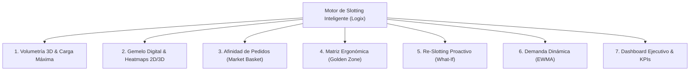

# Propuesta de Evolución y Mejora Profesional: Motor de Slotting (Logix WMS)

## 📌 Resumen Ejecutivo
El presente documento define la propuesta técnica y arquitectónica para elevar el motor de **Slotting** de Logix WMS a los estándares de un sistema **Tier-1 WMS (World-Class)**. La propuesta complementa las reglas base descritas en [`condiciones_slotting.md`](file:///home/fabio/Programacion/logix_react/docs/condiciones_slotting.md) y plantea la transición de un modelo estático y reactivo hacia una plataforma dinámica, volumétrica, ergonómica y proactiva.

---

## 🎯 Objetivos Estratégicos
1. **Optimización del Espacio Cúbico:** Superar el límite rígido de conteo plano de SKUs mediante volumetría 3D y control de peso estructural por nivel.
2. **Reducción de Tiempos de Recorrido en Bodega:** Ubicar mercancía de alta rotación y referencias complementarias en proximidad física a las zonas de despacho.
3. **Ergonomía y Seguridad Laboral:** Implantar la matriz "Golden Zone" y reglas de contención de sustancias/líquidos.
4. **Gemelo Digital Operativo:** Proporcionar a supervisores y administradores un mapa visual 2D/3D con mapas de calor (Heatmaps) en tiempo real.
5. **Re-slotting Proactivo:** Generar campañas automáticas de reubicación para evitar el estancamiento de inventario ("Stock Zombi").

---

## 🏗️ Dimensiones de la Propuesta de Mejora

---

### 1. Volumetría Real y Capacidad 3D (*Cubing & Weight Load Optimization*)

#### Diagnóstico Actual
Actualmente, la restricción de mezcla se limita a un conteo plano de referencias por tipo de zona (`minuteria_max_skus = 3`, `nivel2_max_skus = 6`, `otros_niveles_max_skus = 4`). Este criterio presenta dos debilidades:
* Un único SKU con un alto volumen físico puede desbordar un cajón.
* SKUs de volumen milimétrico consumen un cupo completo, generando desaprovechamiento de espacio.

#### Solución Propuesta
* **Modelado Físico del Bin:** Incorporar en la tabla de ubicaciones (`bin_locations`) dimensiones físicas ($Ancho \times Alto \times Profundidad$) y peso máximo admisible ($Kg_{max}$).
* **Volumen del SKU:** Extraer del maestro de artículos el volumen del empaque unitario ($l \times w \times h$) y peso unitario.
* **Algoritmo de Ocupación Tridimensional:**
  $$\% \text{ Llenado Volumétrico} = \frac{\sum_{i=1}^{n} (V_{\text{unitario}_i} \times Qty_i)}{V_{\text{bin}}} \times 100$$
* **Protección Estructural de Racks:** Validación de peso acumulado por tramo/viga. Si un nivel superior excede la carga segura, el motor restringe automáticamente la sugerencia a niveles inferiores.

---

### 2. Gemelo Digital y Mapa Visual Interactivo con Heatmap (2D / 3D)

#### Diagnóstico Actual
La interfaz en [`frontend/src/pages/SlottingConfig.jsx`](file:///home/fabio/Programacion/logix_react/frontend/src/pages/SlottingConfig.jsx) se basa en una tabla alfanumérica plana paginada a 150 registros.

#### Solución Propuesta
* **Plano Interactivo del Almacén:** Renderizado SVG/Canvas de los pasillos, bahías y niveles del almacén.
* **Mapas de Calor (Heatmaps) Conmutables:**
  * **Heatmap de Ocupación:** Gradiente visual desde verde (disponible / vacío), pasando por amarillo (capacidad óptima 70-85%), hasta rojo (saturado / sobreocupado).
  * **Heatmap de Incompatibilidad (Mis-Slotting):** Detección visual inmediata de anomalías:
    * *Ítems Fríos en Hot Spots:* Artículos de rotación baja (`0`, `Z`, `L`) ocupando ubicaciones premium a nivel de piso.
    * *Ítems Calientes en Cold Spots:* Artículos de alta rotación (`W`, `X`) ubicados en niveles altos o pasillos distantes.
  * **Heatmap de Congestión:** Detección de pasillos con saturación de operarios y equipos durante los turnos pico.

---

### 3. Slotting por Afinidad y Canasta de Salidas (*Market Basket Analysis*)

#### Diagnóstico Actual
El cálculo de ubicación analiza cada producto de manera aislada basándose en su clasificación individual.

#### Solución Propuesta
* **Análisis de Co-ocurrencia en Órdenes:** Procesar las órdenes de salida (Picking / Despacho) para calcular el soporte y confianza de ítems pedidos en conjunto (ej. *Kit de Mantenimiento: Filtro + Aceite + Arandela*).
* **Asignación en Clústeres:**
  * Al ingresar mercancía durante Inbound, el motor evalúa si los ítems afines ya cuentan con stock en la bodega.
  * Sugiere posiciones contiguas o del mismo pasillo para reducir drásticamente los desplazamientos (*Travel Time*) del personal de picking hasta en un 35%.

---

### 4. Matriz Ergonómica y "Golden Zone" (*Strike Zone*)

#### Diagnóstico Actual
Los niveles están clasificados por rangos rígidos (0-1 para alta rotación, 2 para rotación media, 3-5 para pesados).

#### Solución Propuesta
* **Zona Dorada (0.8 m a 1.4 m del suelo):** Los niveles correspondientes a la altura ergonómica (cintura a hombros) concentran el mayor número de líneas de preparación manual sin necesidad de flexión extrema o uso de escaleras.
* **Segmentación Biomecánica:**
  * *Nivel 0 (Piso):* Reservado para bultos pesados de media rotación maniobrables con transpaleta manual.
  * *Niveles 1 y 2:* Concentración de Pareto (80% del picking manual frecuente).
  * *Niveles 3 a 5 (Altura):* Almacenamiento de pallets completos y reserva exclusiva para montacargas.
* **Regla de Gravedad para Químicos y Líquidos:** Sustancias líquidas, aceites o químicos corrosivos se restringen a los niveles inferiores para evitar accidentes o daños a mercancía electrónica en caso de derrames.

---

### 5. Motor de Re-Slotting Proactivo y Simulador "What-If"

#### Diagnóstico Actual
El sistema actual es pasivo: únicamente sugiere una nueva ubicación cuando ingresa mercancía en una recepción física.

#### Solución Propuesta
* **Campaña de Reubicaciones (Housekeeping Automatizado):**
  * Tarea programada en segundo plano que analiza periódicamente las desviaciones entre la rotación real y la ubicación física actual.
  * Genera una cola de órdenes de reubicación interna optimizada para ejecutarse en periodos de baja actividad (turnos nocturnos o valles operativos).
* **Simulador "What-If":**
  * Interfaz en la que el administrador puede ajustar umbrales (ej. modificar el corte de hits para clasificar `W` o variar los límites de mezcla).
  * El sistema simula el impacto antes de guardar: *cuántos bines cambiarían de estado, número de movimientos requeridos y ganancia estimada en metros de caminata por día*.

---

### 6. Velocidad Dinámica Ponderada en el Tiempo (EWMA / Estacionalidad)

#### Diagnóstico Actual
En ausencia de `SIC_Code` en el maestro ERP, el sistema calcula un promedio plano de movimientos de los últimos 90 días.

#### Solución Propuesta
* **Media Móvil Ponderada Exponencial (EWMA):**
  * Permite dar mayor peso a las recepciones y despachos de las últimas 2 a 4 semanas.
  * Reacciona con agilidad ante picos estacionales, campañas comerciales o promociones sin esperar 90 días a que suba la media aritmética.
* **Detección de "Stock Zombi" o Inventario Obsoleto:**
  * Detección automática de referencias con más de 60 días sin actividad ocupando ubicaciones preferenciales.
  * Recomendación directa de traslado a áreas de exilio o almacenamiento denso.

---

### 7. Dashboard Ejecutivo y KPIs de Calidad de Slotting

Incorporación de métricas de desempeño logístico en [`SlottingConfig.jsx`](file:///home/fabio/Programacion/logix_react/frontend/src/pages/SlottingConfig.jsx):

| Métrica | Definición | Impacto Operativo |
| :--- | :--- | :--- |
| **Slotting Health Index (%)** | Porcentaje de SKUs físicos ubicados en su nivel y zona ideal. | Evalúa la salud general de la distribución del almacén. |
| **Metros Promedio por Pick** | Distancia calculada recorrida por operario por línea de picking. | Reducción directa de tiempos muertos y fatiga física. |
| **Densidad Cúbica Efectiva (%)** | Relación entre el volumen real de mercancía y el volumen total de bines ocupados. | Evita la saturación ficticia de estanterías. |
| **Tasa de Desajuste (Mis-slotting Rate)** | Cantidad de referencias críticas en ubicaciones inadecuadas. | Prioriza las campañas de reubicación física. |

---

## 🗺️ Hoja de Ruta de Implementación (Roadmap)

### Fase 1: Núcleo Volumétrico y Ergonómico (Corto Plazo)
* [ ] Extensión del modelo [`BinLocation`](file:///home/fabio/Programacion/logix_react/app/models/sql_models.py) con dimensiones ($W, H, D$) y peso máximo.
* [ ] Actualización de la función de asignación en Rust ([`rust_core/src/slotting.rs`](file:///home/fabio/Programacion/logix_react/rust_core/src/slotting.rs)) para evaluar volumen cúbico además de límite de SKUs.
* [ ] Adición de reglas de gravedad para productos líquidos.

### Fase 2: Visualización y Heatmap Interactivo (Mediano Plazo)
* [ ] Desarrollo de componente interactivo de Pasillos en React para [`SlottingConfig.jsx`](file:///home/fabio/Programacion/logix_react/frontend/src/pages/SlottingConfig.jsx).
* [ ] Filtros visuales para Heatmap de Ocupación y Heatmap de Desalineación (Hot vs. Cold).

### Fase 3: Inteligencia Predictiva y Re-Slotting (Largo Plazo)
* [ ] Integración con el histórico de órdenes de despacho para matriz de afinidad (Market Basket).
* [ ] Módulo generador de órdenes de reubicación proactiva y simulador "What-If".
