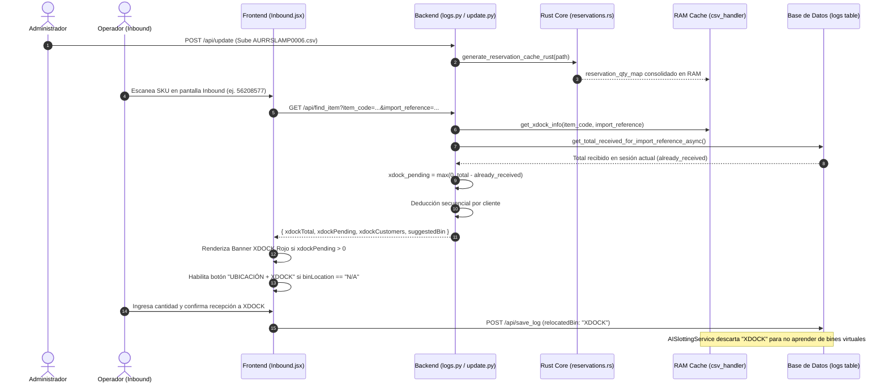

# Resumen Integral de la Lógica de Cross-Docking (Xdock) en Logix WMS

Este documento describe en detalle la arquitectura, el flujo de datos de extremo a extremo, los algoritmos de consolidación y deducción, así como la totalidad de **archivos y campos** que intervienen en el proceso de **Cross-Docking (Xdock)** en el sistema Logix WMS.

---

## 1. Visión General del Proceso de Xdock

El **Cross-Docking (Xdock)** en Logix WMS es un mecanismo prioritario diseñado para identificar inmediatamente aquellos artículos entrantes que ya cuentan con una orden de venta o reserva activa asignada a un cliente final. 

En lugar de almacenar la mercancía en una estantería física (rack), el sistema instruye al operador en tiempo real para segregar el material hacia la zona de despacho rápido o empaque (**XDOCK**), indicando exactamente qué cliente espera cada cantidad y bajo qué Orden de Compra (PO).

### Principios Fundamentales
1. **Prioridad Absoluta sobre Slotting e IA:** Si un ítem tiene reservas pendientes (`xdock_pending > 0`), se omiten las sugerencias convencionales de slotting (rotación SIC, peso, dimensiones) para forzar la separación inmediata.
2. **Aislamiento de la Inteligencia Artificial:** Las ubicaciones virtuales como `"XDOCK"` nunca son aprendidas por el motor predictivo de slotting ni sustituyen las ubicaciones permanentes del maestro de ítems.
3. **Filtrado Contextual por Import Reference:** Las reservas se filtran de forma dinámica según la referencia de importación (`import_reference`) y las órdenes de compra (PO) asociadas al embarque actual.
4. **Deducción Secuencial en Vivo:** El remanente pendiente se recalcula en tiempo real descontando lo que ya ha sido recibido tanto en la base de datos SQL como en la sesión de trabajo local del operador.

---

## 2. Mapa Completo de Archivos Involucrados

| Componente / Capa | Archivo / Recurso | Tipo / Lenguaje | Responsabilidad en Xdock |
| :--- | :--- | :--- | :--- |
| **Fuente de Datos ERP** | [`AURRSLAMP0006.csv`](file:///home/debian/logix/databases/AURRSLAMP0006.csv) | CSV en Disco | Reporte maestro de reservas y órdenes de venta por cliente exportado desde el ERP. |
| **Fuente de Datos ERP** | [`AURRSGLBD0280.csv`](file:///home/debian/logix/databases/AURRSGLBD0280.csv) | CSV en Disco | Reporte de recepciones GRN esperadas con asociación a `Order_Number` (PO). |
| **Caché Intermedio** | [`po_lookup.json`](file:///home/debian/logix/static/json/po_lookup.json) | JSON en Disco | Mapeo relacional entre `Import_Reference`, `Waybill`, `GRN` y números de PO de clientes. |
| **Carga de Archivos** | [`app/routers/update.py`](file:///home/debian/logix/app/routers/update.py) | Python (FastAPI) | Endpoint `/api/update` que recibe `reservation_file`, lo guarda en disco y activa el recalculo en segundo plano. |
| **Núcleo de Alto Rendimiento** | [`rust_core/src/reservations.rs`](file:///home/debian/logix/rust_core/src/reservations.rs) | Rust (PyO3) | Parser ultra-rápido multihilo que lee el CSV, desduplica líneas SO, agrupa por ítem/cliente/PO y arma el diccionario estructurado. |
| **Orquestador de Caché** | [`app/services/csv_handler.py`](file:///home/debian/logix/app/services/csv_handler.py) | Python | Mantiene `reservation_qty_map` en RAM, detecta cambios por `mtime` y ejecuta el filtrado contextual por PO e `Import_Reference`. |
| **Consulta en Tiempo Real** | [`app/routers/logs.py`](file:///home/debian/logix/app/routers/logs.py) | Python (FastAPI) | Endpoint `GET /api/find_item`: Cruza datos maestros, Xdock y recepciones previas para calcular `xdockPending`. |
| **Consultas a Base de Datos** | [`app/services/db_logs.py`](file:///home/debian/logix/app/services/db_logs.py) | Python (SQLAlchemy) | Calcula `get_total_received_for_import_reference_async` y excluye `"XDOCK"` en `get_latest_relocated_bin_async`. |
| **Protección del Algoritmo IA** | [`app/services/ai_slotting.py`](file:///home/debian/logix/app/services/ai_slotting.py) | Python | Evita que `"XDOCK"` contamine los patrones de almacenamiento aprendidos (`learn_from_decision`). |
| **Sincronización PWA/Offline** | [`app/routers/sync.py`](file:///home/debian/logix/app/routers/sync.py) | Python (FastAPI) | Endpoint `/api/sync/delta`: Empaqueta todo el `reservation_qty_map` hacia el cliente móvil/navegador. |
| **Almacenamiento Local Offline** | [`frontend/src/utils/offlineDb.js`](file:///home/debian/logix/frontend/src/utils/offlineDb.js) | JavaScript | Define el ObjectStore `xdock_reservations` en IndexedDB con clave primaria `Item_Code`. |
| **Administrador de Sincronización**| [`frontend/src/utils/syncManager.js`](file:///home/debian/logix/frontend/src/utils/syncManager.js) | JavaScript | Escribe y actualiza las reservas en `xdock_reservations` en IndexedDB para disponibilidad sin internet. |
| **Interfaz de Recepción (UI)** | [`frontend/src/pages/Inbound.jsx`](file:///home/debian/logix/frontend/src/pages/Inbound.jsx) | React (JSX) | Renderiza alerta roja de XDOCK, desglose por clientes, deducción reactiva local y botón `"UBICACIÓN + XDOCK"`. |
| **Interfaz de Actualización (UI)** | [`frontend/src/pages/Update.jsx`](file:///home/debian/logix/frontend/src/pages/Update.jsx) | React (JSX) | Permite subir el archivo `AURRSLAMP0006.csv` y monitorea su timestamp de última modificación. |
| **Tabla de Base de Datos** | Tabla SQL `logs` ([`sql_models.py`](file:///home/debian/logix/app/models/sql_models.py)) | MySQL / SQLite | Almacena los registros recibidos (`importReference`, `itemCode`, `qtyReceived`, `relocatedBin`, etc.). |

---

## 3. Catálogo Detallado de Campos por Archivo y Capa

### A. Archivo CSV de Reservas: `AURRSLAMP0006.csv`

El archivo de reservas exportado desde el ERP contiene múltiples columnas. El parser en Rust ([`reservations.rs`](file:///home/debian/logix/rust_core/src/reservations.rs)) inspecciona las cabeceras de forma no sensible a mayúsculas/minúsculas con alias alternativos:

| Campo / Columna Oficial | Alias Aceptados en Parser | Requerido | Descripción y Uso |
| :--- | :--- | :--- | :--- |
| `Item_Code` | `item_code`, `item`, `item code`, `codigo` | **Sí** | Código único del SKU a recibir. Clave principal de agrupación. |
| `Action_QTY` | `action_qty`, `action qty`, contenga `action` | **Sí (Prioritario)** | Cantidad neta reservada por el cliente. Si falta, usa fallback a `Quantity_reserved` o `qty`. |
| `Quantity_reserved` | `reservation_qty`, `qty`, `cantidad`, `reser` | Fallback | Cantidad de reserva secundaria si `Action_QTY` no está presente. |
| `PO_Number` | `po_number`, `po number`, `po_num`, `order_number`, `customer_reference` | Recomendado | Número de la Orden de Compra asociada al pedido del cliente. Permite filtrar reservas por embarque. |
| `SO_Number` | `so_number`, `so number`, `so_num` | Opcional | Número de la Orden de Venta (Sales Order). Se usa junto con `SO_Line_Number` para desduplicar líneas. |
| `SO_Line_Number` | `so_line_number`, `so line number`, `so_line` | Opcional | Número de línea de la Orden de Venta. Evita duplicados en caso de reintentos en el reporte ERP. |
| `Customer_Name` | `customer_name`, `customer name`, contenga `customer` y `name` | Recomendado | Nombre comercial del cliente final que recibirá la mercancía. |
| `Customer_Code` | `customer_code`, `customer code`, `customer_number` | Recomendado | Código identificador del cliente en el ERP (ej. `00090`, `DRP15`). |
| `Customer_Reference`| `customer_reference`, `customer reference` | Opcional | Referencia interna dada por el cliente (ej. número de orden de compra propia del cliente). |

> [!NOTE]
> **Composición del Nombre de Cliente:**
> En [`reservations.rs`](file:///home/debian/logix/rust_core/src/reservations.rs#L126-L134), si existen tanto `Customer_Code` como `Customer_Name`, el sistema compone la etiqueta unificada: `"{Customer_Code} - {Customer_Name}"` (ejemplo: `"00090 - AGREGADOS Y MEZCLAS CACHIBI SA"`).

---

### B. Mapeo en Memoria RAM y Respuestas API (`reservation_qty_map`)

Generado por Rust y entregado a Python como un diccionario anidado indexado por `Item_Code`:

```json
{
  "56208577": {
    "total": 2.0,
    "reserved_qty": 2.0,
    "customer_name": "00090 - AGREGADOS Y MEZCLAS CACHIBI SA",
    "po_number": "E028900",
    "po_numbers": ["E028900"],
    "po_date": "E028900",
    "customers": [
      {
        "name": "00090 - AGREGADOS Y MEZCLAS CACHIBI SA (PO: E028900)",
        "label": "00090 - AGREGADOS Y MEZCLAS CACHIBI SA (PO: E028900)",
        "customer_name": "00090 - AGREGADOS Y MEZCLAS CACHIBI SA",
        "po_number": "E028900",
        "qty": 2.0
      }
    ]
  }
}
```

---

### C. Archivo de Órdenes de Compra y Embarque: `po_lookup.json`

Generado a partir de `Purchase Order Extractor.xlsx` y `AURRSGLBD0280.csv`. Cruza los embarques internacionales con los códigos de ítem y órdenes:

| Campo en `po_lookup.json` | Ruta / Objeto | Descripción |
| :--- | :--- | :--- |
| `import_reference` | Clave en `ir_to_data` | Código de la referencia de importación activa (ej. `CO-2026-001`). |
| `items[].item_code` | Array dentro de cada IR | SKU incluido en el embarque. |
| `items[].customer_ref` | Array dentro de cada IR | Número de PO o referencia comercial de la orden. Coincide con `PO_Number` del Xdock. |
| `items[].grn` | Array dentro de cada IR | Número(s) de GRN asociados a esa línea de orden de compra. |

---

### D. Tabla de Base de Datos: `logs` (SQL)

La tabla `logs` (definida en [`app/models/sql_models.py`](file:///home/debian/logix/app/models/sql_models.py#L58-L81)) audita cada recepción física realizada en el almacén:

| Columna | Tipo | Uso en la Lógica de Xdock |
| :--- | :--- | :--- |
| `importReference` | `VARCHAR(100)` | Filtra los registros que pertenecen al embarque que se está recibiendo. |
| `itemCode` | `VARCHAR(100)` | Código del ítem recibido para calcular el acumulado. |
| `qtyReceived` | `INTEGER` | Cantidades físicas ya recibidas. Se totalizan con `SUM(qtyReceived)`. |
| `relocatedBin` | `VARCHAR(100)` | Ubicación asignada por el operador. Si el operador asignó `"XDOCK"`, se almacena aquí. |
| `archived_at` | `VARCHAR(50)` | Solo se suman los registros donde `archived_at IS NULL` (recepciones activas). |

---

### E. Campos en la Respuesta de `GET /api/find_item` ([`logs.py`](file:///home/debian/logix/app/routers/logs.py#L229-L255))

| Campo JSON | Tipo | Descripción |
| :--- | :--- | :--- |
| `xdockTotal` | `float` / `int` | Cantidad total reservada en el archivo para este ítem (filtrada por la IR si aplica). |
| `xdockPending` | `float` / `int` | Cantidad neta pendiente de separar: $\max(0, \text{xdockTotal} - \text{already\_received})$. |
| `xdockCustomers` | `list[dict]` | Lista de clientes con la cantidad remanente por despachar (`qty`) y original (`original_qty`). |
| `suggestedBin` | `string` / `null` | Ubicación física sugerida por el slotting. El backend **no** la sobreescribe con `"XDOCK"`. |
| `binLocation` | `string` | Ubicación actual registrada en el maestro de almacén (ej. `"A-01-02"` o `"N/A"`). |

---

## 4. Diagrama del Flujo de Datos



<p align="center">
  
</p>

---

## 5. Reglas de Negocio y Lógica Paso a Paso

### Paso 1: Ingesta y Desduplicación en Rust ([`reservations.rs`](file:///home/debian/logix/rust_core/src/reservations.rs))
1. Abre `AURRSLAMP0006.csv` con lector flexible multilínea.
2. Identifica columnas dinámicamente (`Item_Code`, `Action_QTY`, `PO_Number`, `SO_Number`, `SO_Line_Number`, `Customer_Name`, `Customer_Code`).
3. Para cada registro con cantidad $> 0$:
   - Si tiene `SO_Number` y `SO_Line_Number`, lo desduplica en un mapa usando la tupla `(item_code, po_number, so_num, so_line, cust_val)` tomando el valor máximo para prevenir duplicaciones del ERP.
   - Si no tiene clave de línea SO, lo acumula por `(item_code, po_number, cust_val)`.
4. Agrupa por ítem y por cliente/PO, ordenando alfabéticamente por PO y cliente para garantizar consistencia determinística.

### Paso 2: Filtrado Contextual por Import Reference ([`csv_handler.py`](file:///home/debian/logix/app/services/csv_handler.py#L311-L359))
Un mismo SKU puede tener reservas para distintos clientes asociadas a compras independientes:
1. Al recibir `import_reference`, el backend busca en `po_lookup.json` y en `AURRSGLBD0280.csv` cuáles son los números de PO asignados a ese embarque específico (`target_pos`).
2. Si se encuentran órdenes asociadas, filtra la lista de clientes del Xdock para incluir **únicamente aquellos cuyo `po_number` pertenezca a `target_pos`**.
3. De esta forma, si el SKU tiene reservas de una orden que llegará el próximo mes en otro contenedor, esa reserva **no bloquea** el inventario del embarque actual.

### Paso 3: Deducción en Tiempo Real de Cantidades Recibidas ([`logs.py`](file:///home/debian/logix/app/routers/logs.py#L197-L220))
1. Consulta en la tabla SQL `logs` la suma de `qtyReceived` ya guardada para ese ítem y esa referencia de importación:
   $$\text{already\_received} = \sum \text{qtyReceived}$$
2. Calcula el saldo pendiente:
   $$\text{xdock\_pending} = \max(0, \text{total\_reserved} - \text{already\_received})$$
3. Distribuye el descuento secuencialmente sobre la lista de clientes (`raw_customers`):
   - Si lo recibido cubre la cantidad del primer cliente, ese cliente se descuenta en su totalidad y el excedente pasa al siguiente cliente.
   - El cliente que aún tenga saldo pendiente se incluye en `xdockCustomers` con su cantidad restante (`qty`) y su cantidad inicial (`original_qty`).

### Paso 4: Visualización y Comportamiento en Frontend ([`Inbound.jsx`](file:///home/debian/logix/frontend/src/pages/Inbound.jsx#L1128-L1250))
1. **Cálculo reactivo instantáneo (0 ms):**
   ```javascript
   const effectiveXdockPending = Math.max(0, (itemData?.xdockTotal || 0) - cumulativeQty);
   ```
   Donde `cumulativeQty` incluye los registros recién ingresados en la tabla del navegador antes de refrescar el backend.
2. **Alerta Visual:** Si `effectiveXdockPending > 0`:
   - Se muestra un recuadro de aviso en color rojo con el total reservado y el saldo pendiente.
   - Se despliega la lista individualizada de clientes indicando el nombre y las piezas pendientes para cada uno.
3. **Acceso Rápido a Ubicación XDOCK:**
   - Si el ítem no tiene ubicación física en almacén (`binLocation == "N/A"` o vacío) y hay unidades pendientes por Xdock, el botón de sugerencia cambia a un estilo ámbar/rojo con la leyenda `"UBICACIÓN + XDOCK"`.
   - Al pulsar este botón, el campo de reubicación se completa automáticamente con `"XDOCK"`.

### Paso 5: Protección de la IA y del Algoritmo de Slotting ([`ai_slotting.py`](file:///home/debian/logix/app/services/ai_slotting.py#L106-L107))
1. Cuando un operario almacena un ítem en `"XDOCK"`, el servicio `AISlottingService` recibe el evento en `learn_from_decision()`.
2. El filtro de seguridad detecta que la ubicación pertenece a la lista de bines virtuales:
   ```python
   if final_bin in ["XDOCK", "PUTAWAY", "STAGE", "TRANSITO"]:
       return
   ```
   La función termina de inmediato sin registrar el evento en `AIItemPattern` ni en la caché de aprendizaje.
3. En [`db_logs.py`](file:///home/debian/logix/app/services/db_logs.py#L358), la función `get_latest_relocated_bin_async` también descarta `"XDOCK"`. Así, en futuros arribos del producto (cuando ya no tenga reservas), el sistema no le asignará la zona de despacho por error, sino su cajón físico correcto.

### Paso 6: Disponibilidad Offline (PWA con IndexedDB)
1. Al conectarse o sincronizarse (`/api/sync/delta`), todo el mapa de Xdock se almacena en el ObjectStore `xdock_reservations` del navegador.
2. Si el operador pierde la conexión a la red Wi-Fi del almacén:
   - [`Inbound.jsx`](file:///home/debian/logix/frontend/src/pages/Inbound.jsx#L789-L895) consulta `xdock_reservations` desde IndexedDB.
   - Aplica el mismo filtrado de POs por `import_reference` localmente.
   - Descuenta las cantidades acumuladas en la base de datos offline local (`offlineDb.js`).
   - Muestra las alertas de XDOCK con total fidelidad sin interrumpir la operación.

---

## 6. Resumen de Buenas Prácticas de Mantenimiento

1. **Nombre del Archivo en Actualización:** Al actualizar reservas desde la pestaña de administración, el archivo debe nombrarse preferentemente `AURRSLAMP0006.csv` o contener `"0006"` o `"reserva"` en su nombre para que el router lo identifique automáticamente.
2. **Verificación de Compilación de Rust:** Cualquier ajuste en la detección de columnas o agrupación del CSV de reservas requiere recompilar el módulo `rust_core`:
   ```bash
   VIRTUAL_ENV=/home/debian/logix/venv /home/debian/logix/venv/bin/maturin develop --release --manifest-path /home/debian/logix/rust_core/Cargo.toml
   sudo systemctl restart logix
   ```
3. **Consistencia de Tipos:** Las cantidades de reservas se manejan como flotantes internamente en Rust para absorber decimales del ERP y se presentan como enteros o flotantes limpios al frontend para evitar fallos de renderizado en React.
