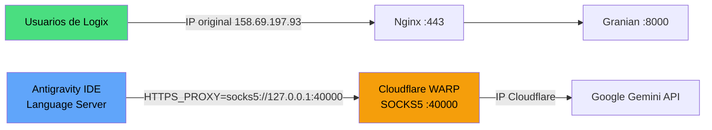

# 🛡️ Implementación de Cloudflare WARP Proxy — Logix VPS

**Fecha:** 2026-09-22  
**Servidor:** `vps-d4b36a16` — OVH Montréal, Canadá 🇨🇦  
**IP pública:** `158.69.197.93` / `2607:5300:205:200::8ca9`

---

## 📋 Resumen del Problema

### Síntoma
Los modelos **Gemini** (todas las versiones: 3.1, 3.7, 3.8 Flash) en Antigravity IDE fallaban con:
```
Error: Agent execution terminated due to error
```
El agente mostraba "Worked for 1s" y luego terminaba inmediatamente.

### Causa Raíz
Encontrada en los logs del language server:
```
FAILED_PRECONDITION (code 400): User location is not supported for the API use.
```

**La API de Gemini rechaza las solicitudes desde Canadá** (la ubicación del VPS en OVH Montréal). Esta restricción geográfica fue implementada por Google recientemente y afecta a todos los modelos Gemini.

> [!NOTE]
> Los modelos Claude (Opus, Sonnet) **no se ven afectados** porque usan un pipeline diferente sin restricciones geográficas.

### Archivo de Logs Clave
```
/home/debian/.antigravity-ide-server/data/logs/*/exthost1/google.antigravity/Antigravity IDE.log
```

---

## ✅ Solución Implementada: Cloudflare WARP en Modo Proxy

Se instaló **Cloudflare WARP** (gratuito) configurado en **modo proxy local (SOCKS5)** — esto **NO** redirige todo el tráfico del servidor, sino que solo está disponible como proxy local en `localhost:40000`.

### Arquitectura



| Tráfico | Ruta | IP Visible | Afectado por WARP |
|---------|------|------------|-------------------|
| Usuarios web (Logix) | Directo | `158.69.197.93` | ❌ **No** |
| Logix backend (Granian) | Directo (systemd) | `158.69.197.93` | ❌ **No** |
| Antigravity / Gemini API | Vía WARP proxy | IP de Cloudflare | ✅ **Sí** |

---

## 🔧 Pasos Realizados

### 1. Instalación de Cloudflare WARP
```bash
# Agregar clave GPG y repositorio
curl -fsSL https://pkg.cloudflareclient.com/pubkey.gpg | \
  sudo gpg --yes --dearmor --output /usr/share/keyrings/cloudflare-warp-archive-keyring.gpg

echo "deb [signed-by=/usr/share/keyrings/cloudflare-warp-archive-keyring.gpg] \
  https://pkg.cloudflareclient.com/ bookworm main" | \
  sudo tee /etc/apt/sources.list.d/cloudflare-client.list

sudo apt-get update && sudo apt-get install -y cloudflare-warp
```

### 2. Registro y Configuración en Modo Proxy
```bash
# Registrar (acepta TOS)
echo "y" | warp-cli registration new

# IMPORTANTE: Modo PROXY, no VPN completa
warp-cli mode proxy

# Conectar
warp-cli connect
```

> [!WARNING]
> **Nunca** cambiar el modo a `warp` (VPN completa) — esto redirige TODO el tráfico del servidor y cambiaría la IP pública, rompiendo el acceso de los usuarios.

### 3. Variables de Entorno para el Language Server

Se configuraron las variables de proxy en **3 ubicaciones** para asegurar que el language_server de Antigravity las herede en cualquier escenario de arranque:

#### a) `/etc/profile.d/warp-proxy.sh` (sistema)
```bash
# Cloudflare WARP SOCKS5 proxy for Google APIs (Gemini)
export HTTPS_PROXY=socks5://127.0.0.1:40000
export HTTP_PROXY=socks5://127.0.0.1:40000
export ALL_PROXY=socks5://127.0.0.1:40000
export NO_PROXY=localhost,127.0.0.1,*.azureedge.net
```

#### b) `~/.config/environment.d/warp-proxy.conf` (systemd user)
```ini
HTTPS_PROXY=socks5://127.0.0.1:40000
HTTP_PROXY=socks5://127.0.0.1:40000
ALL_PROXY=socks5://127.0.0.1:40000
NO_PROXY=localhost,127.0.0.1,*.azureedge.net
```

#### c) `~/.gemini/antigravity-ide/bin/agentapi` (wrapper del agente)
```bash
#!/bin/sh
export HTTPS_PROXY=socks5://127.0.0.1:40000
export HTTP_PROXY=socks5://127.0.0.1:40000
exec "/home/debian/.antigravity-ide-server/bin/2.5.5-.../extensions/antigravity/bin/language_server_linux_x64" agentapi "$@"
```

#### d) `~/.bashrc` y `~/.profile` (sesión SSH)
```bash
# Cloudflare WARP proxy for Antigravity/Gemini API
export HTTPS_PROXY=socks5://127.0.0.1:40000
export HTTP_PROXY=socks5://127.0.0.1:40000
export ALL_PROXY=socks5://127.0.0.1:40000
export NO_PROXY=localhost,127.0.0.1,*.azureedge.net
```

### 4. Protección del Servicio Logix

El servicio `logix.service` (systemd) **NO hereda** las variables de proxy porque define su propio `Environment` y `EnvironmentFile` en su unit file:
```ini
[Service]
EnvironmentFile=/home/debian/logix/.env
Environment="PATH=/home/debian/logix/venv/bin:/usr/local/bin:/usr/bin:/bin"
```

---

## 🧪 Verificación

### Comprobar que WARP está activo
```bash
sudo systemctl is-active warp-svc    # Debe devolver: active
warp-cli status                       # Debe devolver: Connected
```

### Comprobar modo proxy
```bash
warp-cli settings | grep Mode
# Debe mostrar: Mode: WarpProxy on port 40000
```

### Comprobar IPs
```bash
# IP real del servidor (sin proxy)
env -u HTTPS_PROXY -u HTTP_PROXY -u ALL_PROXY curl -s ifconfig.me
# Debe mostrar: 158.69.197.93

# IP vía WARP proxy
curl -s --proxy socks5://127.0.0.1:40000 ifconfig.me
# Debe mostrar una IP de Cloudflare (2a09:bac...)
```

### Comprobar que el Language Server tiene el proxy
```bash
PID=$(pgrep -f "language_server_linux_x64" | head -1)
cat /proc/$PID/environ | tr '\0' '\n' | grep -iE "PROXY"
# Debe mostrar HTTPS_PROXY, HTTP_PROXY, ALL_PROXY
```

---

## 🚨 Troubleshooting

### WARP se desconecta
```bash
warp-cli connect
```

### WARP no arranca tras reboot
```bash
sudo systemctl enable warp-svc
sudo systemctl start warp-svc
warp-cli connect
```

### Gemini sigue fallando después de reconectar WARP
El language_server necesita reiniciarse para heredar el proxy:
1. `Ctrl+Shift+P` → `Developer: Reload Window`, o
2. Cerrar y reabrir la pestaña del IDE

### Los usuarios de Logix no pueden acceder
Si por error se cambió WARP a modo VPN completo:
```bash
warp-cli mode proxy    # Volver a modo proxy
warp-cli disconnect    # Desconectar temporalmente si hay emergencia
```

### Desinstalar completamente WARP (rollback)
```bash
warp-cli disconnect
sudo apt-get remove --purge cloudflare-warp
sudo rm /etc/profile.d/warp-proxy.sh
rm ~/.config/environment.d/warp-proxy.conf
# Eliminar las líneas de proxy de ~/.bashrc y ~/.profile
# Recargar la ventana del IDE
```

---

## 📁 Archivos Modificados/Creados

| Archivo | Acción | Propósito |
|---------|--------|-----------|
| `/etc/apt/sources.list.d/cloudflare-client.list` | Creado | Repositorio de Cloudflare |
| `/etc/profile.d/warp-proxy.sh` | Creado | Variables proxy a nivel sistema |
| `~/.config/environment.d/warp-proxy.conf` | Creado | Variables proxy para systemd user |
| `~/.bashrc` | Modificado | Variables proxy para shells interactivos |
| `~/.profile` | Modificado | Variables proxy para login shells |
| `~/.gemini/antigravity-ide/bin/agentapi` | Modificado | Proxy para el agente API |
| `~/.gemini/antigravity-ide/bin/agentapi.backup` | Creado | Backup del agentapi original |

---

> [!IMPORTANT]
> **El servicio `warp-svc` debe estar corriendo y conectado para que Gemini funcione.** Si el VPS se reinicia, verificar con `warp-cli status` que dice "Connected". Si dice "Disconnected", ejecutar `warp-cli connect`.
