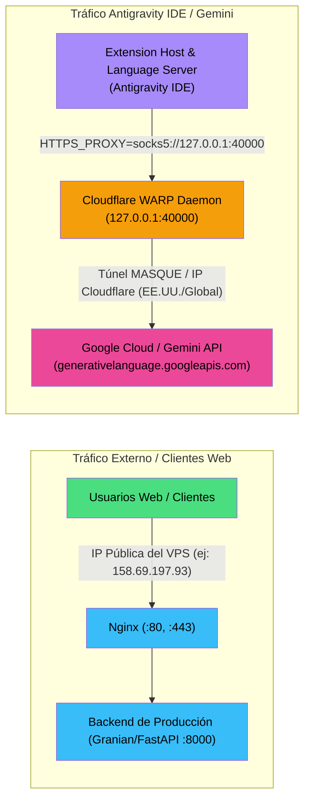

# 🛡️ Guía de Implementación: Cloudflare WARP Proxy en VPS para Gemini API / Antigravity IDE

**Versión:** 2.0 (Actualizada para replicación universal en VPS)  
**Entorno de referencia:** Debian 12 (Bookworm) / Ubuntu 22.04+  
**Objetivo:** Permitir el uso de modelos **Google Gemini** en Antigravity IDE desde VPS en ubicaciones geográficamente no admitidas (ej. Canadá / OVH) **sin alterar el tráfico web ni la IP pública del servidor de producción**.

---

## 📋 1. Diagnóstico y Causa Raíz

### Síntoma en Antigravity IDE
Al seleccionar o interactuar con modelos **Gemini** (3.1 Pro, 3.7 Sonnet/Thinking, 3.8 Flash), la tarea del agente falla casi al instante con:
```text
Error: Agent execution terminated due to error
```
En la barra inferior o estado se observa `"Worked for 1s"` y se detiene.

### Causa Raíz
En los logs del language server de Antigravity (`~/.antigravity-ide-server/data/logs/*/exthost*/google.antigravity/Antigravity IDE.log`):
```text
FAILED_PRECONDITION (code 400): User location is not supported for the API use.
```
Google aplica un bloqueo por geolocalización de IP para la API de Gemini desde ciertas regiones y centros de datos (como centros de datos de OVH en Montréal, Canadá). Los modelos de Anthropic (Claude) funcionan porque usan otra pasarela sin este bloqueo.

---

## 🏗️ 2. Arquitectura de la Solución (Modo Proxy SOCKS5 Local)

La solución consiste en instalar **Cloudflare WARP Client** configurado **estrictamente en modo Proxy SOCKS5 local** en el puerto `40000`.

### ¿Por qué NO usar modo VPN completo (`mode warp`)?
> [!CAUTION]
> En un VPS de producción, **NUNCA** se debe activar el modo VPN tradicional (`warp-cli mode warp`). El modo VPN crea una interfaz `tun` y secuestra la tabla de enrutamiento por defecto (`0.0.0.0/0`), provocando:
> 1. Cambio de la IP pública con la que el servidor responde.
> 2. Pérdida o corte del tráfico web entrante (Nginx, Certbot SSL, FastAPI, puertos expuestos).
> 3. Potencial pérdida de acceso SSH si las rutas no están explícitamente excluidas.

### Diagrama de Enrutamiento Seguro


```mermaid
graph LR
    subgraph Tráfico Externo / Clientes Web
        A["Usuarios Web / Clientes"] -->|"IP Pública del VPS (ej: 158.69.197.93)"| B["Nginx (:80, :443)"]
        B --> C["Backend de Producción (Granian/FastAPI :8000)"]
    end

    subgraph Tráfico Antigravity IDE / Gemini
        D["Extension Host & Language Server<br/>(Antigravity IDE)"] -->|"HTTPS_PROXY=socks5://127.0.0.1:40000"| E["Cloudflare WARP Daemon<br/>(127.0.0.1:40000)"]
        E -->|"Túnel MASQUE / IP Cloudflare (EE.UU./Global)"| F["Google Cloud / Gemini API<br/>(generativelanguage.googleapis.com)"]
    end

    style A fill:#4ade80,color:#000
    style B fill:#38bdf8,color:#000
    style C fill:#38bdf8,color:#000
    style D fill:#a78bfa,color:#000
    style E fill:#f59e0b,color:#000
    style F fill:#ec4899,color:#000
```

### Matriz de Tráfico

| Componente | Mecanismo de Enrutamiento | IP Saliente / Entrante | ¿Afectado por WARP? |
|---|---|---|:---:|
| **Visitas web (Logix/App)** | Red directa VPS | IP Pública del VPS | ❌ **No** |
| **Backend en producción (`logix.service`)** | Red directa VPS (systemd aislado) | IP Pública del VPS | ❌ **No** |
| **Conexiones SSH** | Red directa VPS | IP Pública del VPS | ❌ **No** |
| **Antigravity IDE (Gemini API)** | SOCKS5 `127.0.0.1:40000` | IP Anycast de Cloudflare | ✅ **Sí** |
| **Repositorios Python (PyPI)** | Excluido vía `NO_PROXY` | IP Pública del VPS | ❌ **No** |

---

## 🚀 3. Guía Paso a Paso para Replicar en un Nuevo VPS

Ejecuta estos pasos en el VPS destino con usuario que posea permisos `sudo` (ej. `debian` o `ubuntu`).

### Paso 1: Instalar requisitos previos y repositorio oficial de Cloudflare
```bash
sudo apt-get update
sudo apt-get install -y curl gpg lsb-release

# Agregar clave GPG del repositorio de Cloudflare
curl -fsSL https://pkg.cloudflareclient.com/pubkey.gpg | \
  sudo gpg --yes --dearmor --output /usr/share/keyrings/cloudflare-warp-archive-keyring.gpg

# Configurar el repositorio APT dinámicamente según la versión del SO (Bookworm, Jammy, etc.)
echo "deb [signed-by=/usr/share/keyrings/cloudflare-warp-archive-keyring.gpg] https://pkg.cloudflareclient.com/ $(lsb_release -cs) main" | \
  sudo tee /etc/apt/sources.list.d/cloudflare-client.list

# Instalar cloudflare-warp
sudo apt-get update
sudo apt-get install -y cloudflare-warp
```

### Paso 2: Asegurar y habilitar el servicio `warp-svc` en systemd
```bash
sudo systemctl daemon-reload
sudo systemctl enable --now warp-svc
sudo systemctl is-active warp-svc   # Debe responder: active
```

### Paso 3: Registrar el cliente y configurar MODO PROXY
> [!IMPORTANT]
> Se debe configurar el modo **`proxy` ANTES de conectar**.

```bash
# 1. Registrar cliente aceptando los Términos de Servicio de Cloudflare
warp-cli --accept-tos registration new

# 2. Configurar modo PROXY SOCKS5 (NO VPN completa)
warp-cli mode proxy

# 3. Asignar puerto local (por defecto y estándar: 40000)
warp-cli proxy port 40000

# 4. Establecer conexión
warp-cli connect
```

### Paso 4: Configurar variables de entorno para Antigravity IDE

Para que el servidor de extensiones (`extensionHost`) y el Language Server de Antigravity hereden el proxy sin interferir con servicios de fondo ni descargas de paquetes, se configuran las variables en tres niveles:

#### A) A nivel de sistema: `/etc/profile.d/warp-proxy.sh`
Crea el archivo `/etc/profile.d/warp-proxy.sh`:
```bash
sudo tee /etc/profile.d/warp-proxy.sh > /dev/null << 'EOF'
# Cloudflare WARP SOCKS5 proxy para Google Gemini API en Antigravity IDE
export HTTPS_PROXY=socks5://127.0.0.1:40000
export HTTP_PROXY=socks5://127.0.0.1:40000
export ALL_PROXY=socks5://127.0.0.1:40000
export NO_PROXY=localhost,127.0.0.1,*.azureedge.net,pypi.org,files.pythonhosted.org
EOF

sudo chmod 644 /etc/profile.d/warp-proxy.sh
```

#### B) A nivel de usuario (Shell interactivo y de login): `~/.bashrc` y `~/.profile`
Agrega al final de `~/.bashrc` y `~/.profile` del usuario de trabajo (ej. `/home/debian`):
```bash
cat << 'EOF' >> ~/.bashrc

# Cloudflare WARP proxy for Antigravity/Gemini API
export HTTPS_PROXY=socks5://127.0.0.1:40000
export HTTP_PROXY=socks5://127.0.0.1:40000
export ALL_PROXY=socks5://127.0.0.1:40000
export NO_PROXY=localhost,127.0.0.1,*.azureedge.net,pypi.org,files.pythonhosted.org
EOF

cat << 'EOF' >> ~/.profile

# Cloudflare WARP proxy for Antigravity/Gemini API
export HTTPS_PROXY=socks5://127.0.0.1:40000
export HTTP_PROXY=socks5://127.0.0.1:40000
export ALL_PROXY=socks5://127.0.0.1:40000
export NO_PROXY=localhost,127.0.0.1,*.azureedge.net,pypi.org,files.pythonhosted.org
EOF
```

#### C) A nivel de sesión de usuario de systemd: `~/.config/environment.d/warp-proxy.conf`
Esto garantiza que procesos iniciados por administradores de sesión (PAM/systemd-user) reconozcan el proxy:
```bash
mkdir -p ~/.config/environment.d
tee ~/.config/environment.d/warp-proxy.conf > /dev/null << 'EOF'
HTTPS_PROXY=socks5://127.0.0.1:40000
HTTP_PROXY=socks5://127.0.0.1:40000
ALL_PROXY=socks5://127.0.0.1:40000
NO_PROXY=localhost,127.0.0.1,*.azureedge.net,pypi.org,files.pythonhosted.org
EOF
```

---

## 🔒 4. Garantizar el Aislamiento del Backend de Producción

Para que la aplicación web (FastAPI/Granian/Uvicorn) **no utilice el proxy** y continúe sirviendo directamente a través de la IP de red del VPS:

1. **En el archivo de servicio systemd** (ej. `/etc/systemd/system/logix.service`):
   Asegurar que el servicio use su propio entorno limpio y cargue solo las variables necesarias desde su `.env`, sin heredar `/etc/profile.d`:
   ```ini
   [Service]
   User=debian
   WorkingDirectory=/home/debian/logix
   EnvironmentFile=/home/debian/logix/.env
   Environment="PATH=/home/debian/logix/venv/bin:/usr/local/bin:/usr/bin:/bin"
   # NO agregar HTTPS_PROXY aquí
   ```
2. Si por alguna razón la aplicación hereda variables de entorno globales en el arranque manual, se puede forzar en su `.env` o en el comando del servicio:
   ```ini
   Environment="NO_PROXY=*"
   ```

---

## 🧪 5. Protocolo de Verificación y Pruebas

Ejecuta esta batería de comandos para validar que la configuración sea 100% correcta:

### 1. Comprobar estado de WARP y modo de operación
```bash
warp-cli status
# Salida esperada:
# Status update: Connected
# Network: healthy

warp-cli settings | grep -i "mode"
# Salida esperada:
# (user set)      Mode: WarpProxy on port 40000
```

### 2. Probar resolución y enrutamiento dual de IPs
```bash
# A) IP Real del VPS (debe ser la IP pública original de tu proveedor)
env -u HTTPS_PROXY -u HTTP_PROXY -u ALL_PROXY curl -s https://ifconfig.me
# Ejemplo: 158.69.197.93

# B) IP a través del Proxy WARP (debe ser una IP de Cloudflare, ej: 104.28.x.x o 2a09:bac...)
curl -s --proxy socks5://127.0.0.1:40000 https://ifconfig.me
# Ejemplo: 104.28.214.49
```

### 3. Probar alcance del endpoint de Google Gemini vía SOCKS5
```bash
curl -s -o /dev/null -w "%{http_code}\n" --proxy socks5://127.0.0.1:40000 https://generativelanguage.googleapis.com
# Salida esperada: 404 (Indica conexión exitosa con la API de Google sin bloqueo geográfico)
```

### 4. Verificar que el Language Server de Antigravity tiene las variables
Si Antigravity IDE ya está abierto, busca el PID del proceso `language_server_linux_x64` y lee su entorno:
```bash
PID=$(pgrep -f "language_server_linux_x64" | head -1)
if [ -n "$PID" ]; then
  cat /proc/$PID/environ | tr '\0' '\n' | grep -iE "PROXY"
fi
# Debe mostrar:
# HTTPS_PROXY=socks5://127.0.0.1:40000
# HTTP_PROXY=socks5://127.0.0.1:40000
# ALL_PROXY=socks5://127.0.0.1:40000
# NO_PROXY=...
```

### 5. Reiniciar Antigravity IDE para aplicar cambios
En la interfaz del IDE:
1. Pulsa `Ctrl+Shift+P` (o `F1`).
2. Escribe y selecciona: `Developer: Reload Window`.
3. Selecciona cualquier modelo Gemini (ej. **Gemini 3.8 Flash** o **Gemini 3.7 Thinking**) y envía una consulta. Deberá responder fluidamente sin arrojar el error de región.

---

## ⚡ 6. Script Automatizado para Nuevos Servidores (`setup_warp_proxy.sh`)

Puedes copiar y ejecutar este script en cualquier nuevo VPS (Debian/Ubuntu) para realizar toda la instalación y configuración en menos de 2 minutos:

```bash
#!/usr/bin/env bash
set -euo pipefail

echo "=========================================================="
echo "🚀 Configurando Cloudflare WARP en Modo Proxy SOCKS5"
echo "=========================================================="

if [ "$EUID" -ne 0 ]; then
  echo "❌ Por favor ejecuta este script con privilegios sudo o root."
  exit 1
fi

TARGET_USER="${SUDO_USER:-$(logname 2>/dev/null || echo debian)}"
TARGET_HOME=$(eval echo "~${TARGET_USER}")

echo "👤 Usuario objetivo: ${TARGET_USER} (${TARGET_HOME})"

# 1. Instalar dependencias
apt-get update -y
apt-get install -y curl gpg lsb-release

# 2. Agregar clave GPG y repositorio de Cloudflare
curl -fsSL https://pkg.cloudflareclient.com/pubkey.gpg | \
  gpg --yes --dearmor -o /usr/share/keyrings/cloudflare-warp-archive-keyring.gpg

CODENAME=$(lsb_release -cs)
echo "deb [signed-by=/usr/share/keyrings/cloudflare-warp-archive-keyring.gpg] https://pkg.cloudflareclient.com/ ${CODENAME} main" \
  > /etc/apt/sources.list.d/cloudflare-client.list

apt-get update -y
apt-get install -y cloudflare-warp

# 3. Iniciar servicio
systemctl daemon-reload
systemctl enable --now warp-svc
sleep 2

# 4. Configurar WARP en modo Proxy
echo "⚙️ Configurando warp-cli en modo proxy..."
sudo -u "${TARGET_USER}" warp-cli --accept-tos registration new || true
sudo -u "${TARGET_USER}" warp-cli mode proxy
sudo -u "${TARGET_USER}" warp-cli proxy port 40000
sudo -u "${TARGET_USER}" warp-cli connect

# 5. Configurar variables de entorno globales
echo "📝 Escribiendo variables de entorno en /etc/profile.d/warp-proxy.sh..."
cat << 'EOF' > /etc/profile.d/warp-proxy.sh
# Cloudflare WARP SOCKS5 proxy for Google APIs (Gemini)
export HTTPS_PROXY=socks5://127.0.0.1:40000
export HTTP_PROXY=socks5://127.0.0.1:40000
export ALL_PROXY=socks5://127.0.0.1:40000
export NO_PROXY=localhost,127.0.0.1,*.azureedge.net,pypi.org,files.pythonhosted.org
EOF
chmod 644 /etc/profile.d/warp-proxy.sh

# 6. Configurar variables a nivel de usuario
echo "📝 Configurando .bashrc, .profile y environment.d para ${TARGET_USER}..."
mkdir -p "${TARGET_HOME}/.config/environment.d"
cat << 'EOF' > "${TARGET_HOME}/.config/environment.d/warp-proxy.conf"
HTTPS_PROXY=socks5://127.0.0.1:40000
HTTP_PROXY=socks5://127.0.0.1:40000
ALL_PROXY=socks5://127.0.0.1:40000
NO_PROXY=localhost,127.0.0.1,*.azureedge.net,pypi.org,files.pythonhosted.org
EOF
chown -R "${TARGET_USER}:${TARGET_USER}" "${TARGET_HOME}/.config"

# Añadir a .bashrc si no existe ya
if ! grep -q "socks5://127.0.0.1:40000" "${TARGET_HOME}/.bashrc" 2>/dev/null; then
  cat << 'EOF' >> "${TARGET_HOME}/.bashrc"

# Cloudflare WARP proxy for Antigravity/Gemini API
export HTTPS_PROXY=socks5://127.0.0.1:40000
export HTTP_PROXY=socks5://127.0.0.1:40000
export ALL_PROXY=socks5://127.0.0.1:40000
export NO_PROXY=localhost,127.0.0.1,*.azureedge.net,pypi.org,files.pythonhosted.org
EOF
fi

# Añadir a .profile si no existe ya
if ! grep -q "socks5://127.0.0.1:40000" "${TARGET_HOME}/.profile" 2>/dev/null; then
  cat << 'EOF' >> "${TARGET_HOME}/.profile"

# Cloudflare WARP proxy for Antigravity/Gemini API
export HTTPS_PROXY=socks5://127.0.0.1:40000
export HTTP_PROXY=socks5://127.0.0.1:40000
export ALL_PROXY=socks5://127.0.0.1:40000
export NO_PROXY=localhost,127.0.0.1,*.azureedge.net,pypi.org,files.pythonhosted.org
EOF
fi

# 7. Test de validación
echo "----------------------------------------------------------"
echo "🔍 Comprobación de estado:"
sudo -u "${TARGET_USER}" warp-cli status
echo "IP Directa VPS: $(env -u HTTPS_PROXY -u HTTP_PROXY -u ALL_PROXY curl -s https://ifconfig.me || echo 'N/A')"
echo "IP Saliente Proxy: $(curl -s --proxy socks5://127.0.0.1:40000 https://ifconfig.me || echo 'N/A')"
echo "----------------------------------------------------------"
echo "✅ Instalación finalizada con éxito."
echo "👉 En Antigravity IDE ejecuta 'Developer: Reload Window' para activar Gemini."
```

---

## 🛠️ 7. Mantenimiento y Resolución de Problemas

### 1. El servicio muestra "Disconnected" tras reinicio del VPS
El daemon de WARP (`warp-svc`) suele reconectarse automáticamente gracias al parámetro `Always On: true`. Si por algún motivo se encuentra desconectado:
```bash
warp-cli connect
```

### 2. Error por desconexión temporal de red o cuelgue del demonio
```bash
sudo systemctl restart warp-svc
sleep 2
warp-cli connect
```

### 3. Accidentalmente se cambió a modo VPN completo
Si alguien ejecutó `warp-cli mode warp` por error y se perdió la IP pública:
```bash
warp-cli mode proxy
warp-cli proxy port 40000
warp-cli connect
```

### 4. Procedimiento de Desinstalación Limpia (Rollback Completo)
Si en algún momento se desea remover Cloudflare WARP por completo del VPS:
```bash
warp-cli disconnect
sudo apt-get purge -y cloudflare-warp
sudo rm -f /etc/apt/sources.list.d/cloudflare-client.list
sudo rm -f /usr/share/keyrings/cloudflare-warp-archive-keyring.gpg
sudo rm -f /etc/profile.d/warp-proxy.sh
rm -f ~/.config/environment.d/warp-proxy.conf

# Limpiar las variables añadidas en ~/.bashrc y ~/.profile manualmente o con sed:
sed -i '/socks5:\/\/127.0.0.1:40000/d' ~/.bashrc
sed -i '/pypi.org/d' ~/.bashrc
sed -i '/socks5:\/\/127.0.0.1:40000/d' ~/.profile
sed -i '/pypi.org/d' ~/.profile
```
